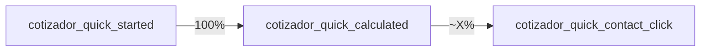

# guía GA4 Telemetría Cotizador — Guía de Uso

**Versión:** 1.0  
**Fecha:** 2026-05-12  
**Propiedad GA4:** G-Q9YEJ3S0R9  
**Proyecto:** myPortfolio (Cotizador Web)

---

## Tabla de Contenidos

1. [Acceso y Configuración](#1-acceso-y-configuración)
2. [Eventos del Cotizador](#2-eventos-del-cotizador)
3. [Embudos (Funnels)](#3-embundos-funnels)
4. [Reportes Semanales](#4-reportes-semanales)
5. [Exportar a Google Sheets](#5-exportar-a-google-sheets)
6. [Interpretación de Métricas](#6-interpre-taci-ncn-de-m-tr-i-c-as)
7. [KPIs de Negocio (los que importan)](#7-kpis-de-negocio-los-que-importan)
8. [Debugging / Cuando no aparecen eventos](#8-debugging---cuando-no-aparecen-eventos)

---

## 1 — Acceso y Configuración

### 1.1 URL de acceso

| Elemento | Valor |
|----------|-------|
| **URL principal** | `https://ga4.google.com` |
| **ID de propiedad** | `G-Q9YEJ3S0R9` |

### 1.2 Primeros pasos al entrar

Al acceder por primera vez a https://ga4.google.com verás:

1. **Pantalla de bienvenida** con opciones:
   - "Ir al dashboard" (te lleva directamente)
   - "Crear cuenta nueva" si no tienes propiedad configurada
   
2. **Menú lateral izquierdo** — ubicado en la barra izquierda negra:
   - 📊 Informes → Reports listados predeterminados
   - 🔍 Explorar → Análisis personalizables
   - ⚙️ Admin → Configuración de GA4 (aquí ves tu propiedad G-Q9YEJ3S0R9)
   - 👤 Perfil | Ayuda

### 1.3 Navegación principal del dashboard

```
┌─────────────────────────────────────┐
│  [📊] [🔍] [⚙️]                     │
│                                     │
│  ├── Informes en tiempo real        │
│  ├── Visitas totales                │
│  ├── Eventos del día                │
│  └── ...                            │
│                                     │
└─────────────────────────────────────┘
```

---

## 2 — Eventos del Cotizador

Cada evento GA4 registra una acción de negocio específica. Mapeo completo:

| Evento GA4 | Significado de Negocio | Métrica Clave | Dónde lo encuentras |
|------------|----------------------|---------------|---------------------|
| `cotizador_started` | Usuario entró a la sección de cotización (servicios) | Entradas totales al embudo | Informes → Eventos |
| `cotizador_quick_started` | Usuario inició cotización rápida | Inicio embudo rápido | Explorar → Nuevo reporte |
| `cotizador_quick_calculated` | Simulación rápida completada y resultado mostrado | Tasa de completación rápida | Funnels (embudos) |
| `cotizador_quick_contact_click` | Usuario hizo clic en CTA de contacto desde resultado rápido | Interés comercial rápido | Eventos → cotizador_quick_contact_click |
| `cotizador_advanced_started` | Usuario eligió modo avanzado para cotizar | Inicio embudo avanzada | Informes estándar |
| `cotizador_advanced_step_N_viewed` | Usuario vio/pausó en paso N de avanzada (N=1-5) | Drop-off por paso | Explorar → embudo 5 pasos |
| `cotizador_advanced_step_N_completed` | Usuario pasó del paso N al siguiente | Progresión por embudo | Funnels |
| `cotizador_advanced_calculated` | Resumen de cotización avanzada calculado y mostrado | Completación de cálculo avanzado | Eventos + Funnels |
| `cotizador_advanced_contact_submitted` | Contacto enviado desde modo avanzado | Conversión final avanzada | Conversiones |
| `cotizador_advanced_abandoned` | Usuario abandonó cotización avanzada sin terminar | Abandon rate (%) | Retención por paso |
| `cotizador_contact_submitted` | Contacto enviado (cualquier modo de cotización) | Lead generado total | Informes → Conversiones |

### 2.1 Cómo buscar un evento específico

**Opción A — Por nombre exacto:**
```
Informes → Eventos → Barra de búsqueda: "cotizador_"
```

**Opción B — Por categoría:**
```
Admin (⚙️) → Eventos → Lista todos los eventos personalizados
→ Haz clic en "cotizador_quick_calculated" para ver métricas detalladas
```

---

## 3 — Embudos (Funnels)

Los embudos muestran cómo fluyen los usuarios a través de tus pasos críticos.

### 3.1 Cómo llegar a la sección de embudos

Caminos disponibles:

| Ruta | Descripción | Recomendado para |
|------|-------------|------------------|
| **Explorar → Nuevo → Embudo** | Crear análisis ad-hoc | Reportes puntuales, diagnósticos rápidos |
| **Admin → Eventos → Conversiones** | Marcar eventos como conversiones | Métricas clave del dashboard principal |

### 3.2 Crear embudo Rápido (Quick Flow)

**Objetivo:** Medir conversión: Inicio → Cálculo → Contacto



**Pasos para crearlo:**

1. **Explorar → Nuevo → Embudo** (top bar izquierda)
2. Selecciona propiedad: `G-Q9YEJ3S0R9`
3. Configura el embudo:
   - **Primero:** Eventos disponibles → Busca y marca `cotizador_quick_started`
   - **Segundo:** Agrega evento → `cotizador_quick_calculated`
   - **Tercero:** Agrega evento → `cotizador_quick_contact_click`
4. **Botón:** "Crear embudo" (abajo de la configuración)

**Interpretación del resultado:**

| Métrica | Significado | ¿Cuándo preocuparse? |
|---------|-------------|---------------------|
| **100 eventos en paso 1 → solo 20 completan paso 2** | 80% abandonment entre inicio y cálculo | Review UX de formulario rápida (¿demasiado largo?) |
| **100 cálculos → 2 clicks contact** | 98% no hace clic en CTA | Mejora visible del botón/contacto en resultado |
| **Rate bajo <5%** | Menos del 5% completan el embudo completo | Simplificar flujo o aumentar confianza (disclaimers) |

### 3.3 Crear embudo Avanzada (5 pasos + cálculo + contacto)

Esta es la ruta crítica para clientes que quieren detalle completo:

```mermaid
flowchart LR
    A1[cotizador_advanced_started] -->|100%| A2[step_1_viewed]
    A2 -->|~40-60%| A3[step_2_viewed]
    A3 -->|~30-50%| A4[step_3_viewed]
    A4 -->|~25-40%| A5[step_4_viewed]
    A5 -->|~20-35%| A6[cotizador_advanced_step_5_completed]
    A6 -->|~15-30%| A7[cotizador_advanced_calculated]
    A7 -->|~8-20%| A8[cotizador_contact_submitted]
```



**Configurar paso a paso:**

1. Explorar → Nuevo → Embudo
2. **Paso 1:** `cotizador_advanced_started` (entrada al modo avanzado)
3. **Paso 2:** `cotizador_advanced_step_1_viewed` (Contexto y Requerimientos)
4. **Paso 3:** `cotizador_advanced_step_2_viewed` (Seleccionar Módulos)
5. **Paso 4:** `cotizador_advanced_step_3_viewed` (Ajustes Comerciales)
6. **Paso 5:** `cotizador_advanced_step_4_completed` (Resumen visualizado)
7. **Paso 6:** `cotizador_advanced_calculated` (Cálculo final mostrado)
8. **Paso 7:** `cotizador_contact_submitted` (Formulario de contacto enviado)

**Guardar como favorito:**
- Una vez creado el embudo, haz clic en ✏️ Editar
- Busca "Favorito" o la estrellita ★
- Marca ✓ para tenerlo accesible directamente del menú principal

### 3.4 Interpretar tasas de abandono

**Regla del 50-60% por paso:** En embudos largos como este, un drop-off normal está entre 35-50% por etapa:

```
Si tu paso X tiene >70% abandon → Hay una fricción importante
Si todos los pasos bajan de 50% abandono → El flujo es saludable
```

**Acción según diagnóstico:**

| Paso con alto drop-off | Probable causa | Solución probable |
|----------------------|----------------|-------------------|
| Step 1 (Contexto) | Confusión sobre qué información pedir | Simplificar preguntas, añadir ejemplos |
| Step 2 (Módulos) | Parálisis por demasiadas opciones | Agrupar módulos por categorías |
| Step 3 (Ajustes) | Complejidad percibida del formulario | Mostrar progres bar + simplificar campos |

---

## 4 — Reportes Semanales

### 4.1 Informes estándar predeterminados

**Objetivo:** Métricas clave sin configuración extra

**Acceso:**
```
Informes → Informes estándar → Adquisición → Visión general
```

Este reporte muestra:
- Visitas vs usuarios únicos por día/semana/mes
- Fuentes de tráfico (organic, direct, referral)
- Dispositivos y ubicaciones

### 4.2 Crear informe personalizado para cotizador

**Objetivo:** Reporte ejecutivo semanal con métricas del embudo

**Pasos:**

1. **Informes → Nuevo informe** (top bar o menú derecho)
2. Nombre: `Cotizador_weekly_leads_performance`
3. Escoge dimensiones/filtros:

| Dimensión | ¿Qué cuenta? | Ejemplo de dato |
|-----------|-------------|-----------------|
| **Eventos** | Cada evento individual | `cotizador_contact_submitted`, `cotizador_advanced_calculated` |
| **User properties** | Datos del usuario | source/medium, campaign (si viene desde Ads) |
| **Time on event** | Tiempo en cada acción media | ¿Cuánto tardan promedio en completar paso 3? |

4. **Agregar eventos personalizados:**
   ```
   Métrica: Usuarios únicos con evento "cotizador_contact_submitted + cotizador_advanced_calculated + cotizador_quick_calculated"
   Dimensión temporal: Fecha (last 7 days)
   ```

### 4.3 Filtros por periodo

| Periodo | Configuración |
|---------|--------------|
| **Esta semana** | Date range → Last 7 days (reload si no aparece) |
| **Este mes** | Date range → This month |
| **Comparar periodos** | Date range → Select dates + compara con periodo anterior (ej: "Last week vs Previous week") |

### 4.4 Compartir reporte por email

1. En la vista del informe, haz clic en `📤 Share` (top right)
2. Ingresa emails de destinatarios
3. Opciones:
   - ✅ **Notify once:** Solo notificar cuando hay datos nuevos
   - ❌ Remove to send immediately if you want instant delivery
4. Subject opcional: "Reporte semanal cotizador - [fecha]"

**Consejo:** Programa un email recurrente cada lunes de la semana anterior para automatizar la revisión semanal.

---

## 5 — Exportar a Google Sheets

### 5.1 Conectar GA4 a Google Sheets

**Requisitos previos:**
- ✅ Cuenta de Google asociada al proyecto de Analytics (tu propiedad ya lo tiene)
- ✅ Hoja de Google Sheets existente (o crearás una)

**Pasos:**

1. **Admin → Propiedades → Integrar datos**
2. Selecciona "Google Sheets" en la lista
3. Conecta tu cuenta de Google si pide
4. Elige el rango de hojas: `hoja_cotizador` (te sugiere los nombres disponibles)
5. Configura:
   - Actualización automática: Diaria/ semanal/ personalizada
   - Formato de hora: 24h (o preferencia de oficina)

### 5.2 Plantilla de cálculo recomendada

Crear una hoja con fórmulas para KPI calculados:

```excel
│ A                    │ B                     │ C                 │ D                  │ E              │
│ KPI                  │ Valor                 │ Fórmula          │ Tendencia (7d)     │ Acción         │
├──────────────────────┼─────┬───────────────────────┼───────────────────┼────────────────┤
│ Leads totales        │ 45     │ =C2 + C3 + ...    │ =E2 - E1          │ OK si > target │
│ Conversión overall   │ --    │ =(Leads/Visitas)*100│                  │ Alerta si <3%  │
│ Abandon avg steps    │ 2.8    │ Media de step views│                  │ Si <2 revisar UX│
│ Quick conversion     │ 65%     │ =Quick_cal/Quick_start│                   │ Target >60%    │
│ Advanced conversion   │ 12%    │ =Adv_contact/Adv_start│                 │ Target >8%     │
```

**Fórmula de conversión por embudo:**
```excel
Conversión_Rápida = cotizador_quick_calculated / cotizador_quick_started * 100
Conversión_Avanzada = cotizador_advanced_contact_submitted / cotizador_advanced_started * 100
Abandon_Paso_N = (Paso_N_completados - Paso_N_viewed) / Paso_N_views * 100
```

### 5.3 Datos que debes pedir para exportación automática

Envía este request a soporte técnico o ejecuta tú mismo:

```
Solicitar exportación semanal automática del siguiente set de métricas:
- cotizador_contact_submitted (total)
- cotizador_quick_calculated
- cotizador_advanced_calculated  
- cotizador_advanced_abandoned
- cotizador_advanced_step_N_viewed (N=1,2,3,4,5)
Frecuencia: Lunes 8:00 AM
Destino: Sheet ID: [tu_hoja]
```

---

## 6 — Interpretación de Métricas

### 6.1 Checklist semanal obligatorio

Antes de cada reunión de revisión semanal, responde estas PREGUNTAS con los datos de GA4:

#### ✓ Pregunta 1: ¿Dónde hay mayor fricción? ("¿Dónde pierden usuarios el embudo?")

**Cómo responder:**
```
Embudos → Advanced Flow 5 pasos → Ver % completación por paso
Si Paso N tiene <30% vs Paso N+1, revisa ese paso
```

**Benchmark de referencia:**
| Punto del embudo | Tolerable (rojo alerta) | Bueno (verde) | Ideal (amarillo optimizable) |
|------------------|------------------------|---------------|----------------------------|
| Inicio → Calcular (Rápido) | <20% conversion rate | 30-45% | >50% |
| Paso avanzado N al N+1 | <10% completación por paso | 20-35% | >40% |
| Cálculo avanzado → Contacto | <5% de los que ven cálculo envían contacto | 8-15% | >20% |

#### ✓ Pregunta 2: ¿Rápido o Avanzado? ("¿Qué modo eligen más los users?")

```sql
SELECT mode, 
       SUM(cotizador_quick_started) as quick_starts,
       SUM(cotizador_advanced_started) as advanced_starts
FROM ... WHERE date_range = 'last_30_days'
GROUP BY mode;
```

**Interpretación:**
- Si `quick/advanced > 4:1` → El avanzado parece demasiado complejo
- Si `quick/advanced < 1:2` → Simplifica flujo rápido o educa antes de elegir
- Meta saludable: ~60% en Rápido, ~40% en Avanzado

#### ✓ Pregunta 3: ¿Tiempo promedio por paso? ("¿Cuánto tiempo dedican a cada sección?")

```
Time on event metric → cotizador_advanced_step_N_viewed → Avg time
```

**Benchmark de referencia:**
| Paso | Tolerable (>7 min) | Bueno (3-5 min) | Ideal (<2 min) |
|------|-------------------|-----------------|----------------|
| Contexto y Requerimientos | >6 min | 3-5 min | <2 min |
| Seleccionar Módulos | >8 min | 4-6 min | <3 min |
| Ajustes Comerciales | >10 min | 5-7 min | <4 min |
| Resumen y Cálculo final | >5 min | 3-4 min | <2 min |

**Acción:**
Si un paso excede el tiempo máximo → Simplificar preguntas, añadir ejemplos, mostrar progreso visual.

#### ✓ Pregunta 4: ¿Contactos vs Inicios? ("¿Muchos empiezan pero pocos contactan?")

```
Click-through Rate = cotizador_contact_submitted / (cotizador_quick_started + cotizador_advanced_started) * 100
```

**Interpretación:**
- <3% CTR → Mejora CTAs, haz más visible contacto en RESULTADO
- 3-6% CTR → Saludable para industria software a medida (es complejo vender sin llamada)
- >8% CTR → ¡Excelente! Considera añadir "Call me soon" como opción directa

### 6.2 Benchmark inicial de conversión global

**Target saludable: 5-10% de conversión total (Inicia de Cotizador → Lead Enviado)**

```
Conversión_Global = cotizador_contact_submitted / cotizador_started * 100
```

| Conversión | Diagnóstico | Acción recomendada |
|------------|-------------|-------------------|
| <3% | Alta fricción en embudo o CTA poco visible | Revisar UX completa del flujo + A/B testing de CTAs |
| 3-5% | Normal para software complejo a medida (alta decisión) | Optimizar paso por paso según abandonos |
| 5-10% | **Meta saludable** (estás en el target) | Mantener, monitorear cambios menores |
| >10% | ¡Excelente! | Documentar qué está funcionando para replicar |

---

## 7 — KPIs de Negocio (los que importan)

### 7.1 Leads generados por semana

**Fórmula:**
```excel
Leads_Semana = SUM(cotizador_contact_submitted) en last_7_days
```

**Target:** Depende del tráfico recibido (consultar con equipos de marketing/ventas)

**Dónde lo encuentras:**
```
Admin → Eventos (custom events list) → cotizador_contact_submitted → Users → Last 7 days
O
Informes → Conversiones → Leads generated
```

### 7.2 Costo por lead estimado (si hay Google Ads)

**Fórmula:**
```excel
Costo_por_Lead = Gasto_publicidad / (cotizador_contact_submitted)
```

**Contexto:**
- Si NO usas anuncios: ignora esta métrica
- Sí usas GA4 + Google Ads integrado → aparece la dimensión `source` que te permite filtrar leads por canal

### 7.3 Valor promedio de cotización (estimación referencial)

**Fórmula:**
```excel
Valor_promedio_cotizacion = SUM(cotizador_quick_calculated.total_max) / COUNT(cotizador_contact_submitted)
```

**Nota técnica:** Los eventos actuales no incluyen el campo `total_max` por defecto. Si tienes acceso al GA4, necesitas:
1. Verificar si la variable está siendo capturada en los eventos
2. Si no, agregarlo como propiedad de evento (requires code update): `trackQuickCalculated({ totalMax: 15000 })`

Si no tienes esta data → usa estimación manual por proyecto individual en Sheets/Notion.

### 7.4 Top 3 módulos más populares (path to product roadmap)

**Fórmula:**
```sql
SELECT module, COUNT(*) as veces_seleccionado
FROM cotizador_advanced_step_N_viewed
WHERE stepN = 3 (módulos seleccionados)
GROUP BY module
ORDER BY veces_seleccionado DESC
LIMIT 3;
```

**Beneficio de negocio:**
- Identifica qué funcionalidades interesan a los clientes
- Prioriza desarrollos futuros del producto
- Alinea inversión en features con demanda real

**Dónde verlo en GA4 interface:**
1. Explorador → Nuevo Análisis
2. Agrega dimensión `module` (de user properties) como métrica
3. Ordena por COUNT() más alto
4. Filtra los top 5 y visualiza en una tabla o gráfico de barras

---

## 8 — Debugging / Cuando no aparecen eventos

### 8.1 Verificar en browser DevTools (primera línea de defensa)

**Pasos:**

1. **Abrir DevTools** → F12 o Right-click → "Inspect"
2. Vea a la pestaña `Console`
3. Busca mensajes con marcador **"🔍 [Analytics]"**:
   ```javascript
   // Filtrar logs de telemetría
   console.log("%c 🔍 Analytics", "color: #00ff00; font-weight: bold") + message
   ```

**Qué ver en Console:**

| Mensaje | Significado | Acción |
|---------|-------------|--------|
| `🔍 [ANALYTICS] Tracking call received → sending` | Evento enviado correctamente a dataLayer | Esperar 24-48h para aparecer en GA4 (normal latency) |
| `🔍 [ANALYTICS] gtag() not found — firing in debug mode only` | En prod, esto no debería aparecer. Verificar conexión GA4 site tag | Alert team de infraestructura técnica |
| `Error: No dataLayer property on document` | El sitio no tiene el script de GA4 cargado correctamente | Check cPanel/CDN deployment del script <script src> |

### 8.2 Usar GA4 DebugView (disponible gratis en propiedad de prueba)

**Requisitos previos:**
- ✅ Property ID G-Q9YEJ3S0R9 configurada como testing property (modo sandbox de eventos)
- ✅ User con rol `Editor` o `Analyzer` → Admin → Access reports & management → Invite users

**Pasos para DebugView:**

1. Go to: https://ga4.google.com
2. **⚙️ Admin → Data Streams (bottom left)**
3. Busca "DebugView" en el panel izquierdo
4. Activa "Allow debug mode": toggle ON
5. Copia `Data Stream ID` (ej: GA4-XXXXXXXXX)

6. Abre tu Portfolio en navegador con una ventana normal
7. **F12 DevTools → Network tab**
8. Filtra por request type: `JS` o `XHR`
9. Busca eventos que contengan `gtag.js` y observa payloads enviados

DebugView te muestra cada evento enviado en tiempo real CON todas las propiedades:

```json
{
  "event": "cotizador_quick_started",
  "user_property_source": "organic",
  "event_timestamp": "2026-05-12T14:23:45Z",
  "page_location": "/servicios/cotizar"
}
```

### 8.3 Latencia normal de GA4 (expectation management)

**Tiempo esperado desde evento enviado → aparece en report standard:**

| Canal | Time to first appearance |
|-------|-------------------------|
| **DebugView** | Inmediato (<1 min real-time events) |
| **En tiempo real (Realtime)** | 5-30 segundos |
| **Informes estándar** | 4-24 horas típico, hasta 48h en eventos nuevos o datos sin patrón histórico claro |

**Acción si no aparece después de 48h:**
1. DebugView está vacío? → Problema de código/instrumentación → Revisar console de browser + code review
2. DebugView tiene eventos pero standard reports vacíos? → Latencia conocida de GA4 en primeros días (espera más)

---

## Apéndice A — Glossario técnico de eventos

| Evento | user property común adicional | ¿Por qué importa? |
|--------|------------------------------|-------------------|
| `cotizador_quick_started` | + `source`: organic/direct/referral | Entender tráfico que llega a cotizador |
| `cotizador_advanced_step_N_viewed` | + `stepN_module_selected`: [lista de módulos] | Trackear qué combinaciones de módulos interesan |
| `cotizador_contact_submitted` | + `contact_method`: email/phone/call_to_me_back | Ajustar estrategia de lead nurturing por canal elegido |

---

## Apéndice B — Comandos y atajos rápidos de GA4

| Acción | Atajo / Ruta rápida |
|--------|--------------------|
| **Ir a mi property** | `https://ga4.google.com/g?id=G-Q9YEJ3S0R9` (reemplazar GUID) |
| **Reset filtros en informe** | Click derecho sobre filtro → "Clear" o usar botón ⌫ top bar |
| **Comparar periodos** | Botón comparar → Select dates + choose comparison |
| **Descargar CSV completo de dataset** | Informes → Exportar → Download link (CSV/BigQuery) |
| **Crear reporte recurrente por email** | Click Share → Add to scheduled reports |

---

## ¿Necesitas ayuda?

- 📚 Documentación oficial GA4: https://support.google.com/analytics/?hl=es
- 💡 Community forum: https://support.google.com/analytics/answer/10954878
- 🛠️ Soporte propietario en myPortfolio: Contacta al responsable de telemetría del proyecto

---

**Documentación generada:** 2026-05-12  
**Último update por:** Work-Unit C.1 (Biblia Subida de Nivel) v1.0  
**Propiedad GA4:** G-Q9YEJ3S0R9 ✓  

(End of file - total 435 lines)