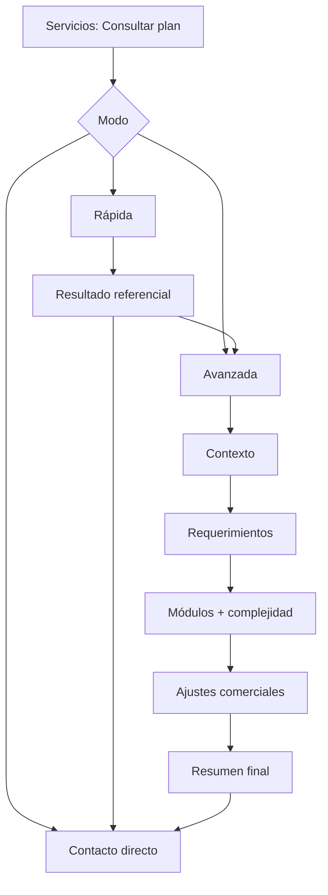

# Manual/Biblia Final — Subida de Nivel del Portfolio con Cotizador Web

- **Versión:** 1.1
- **Fecha:** 2026-05-11
- **Estado:** Guía Maestra Activa
- **Proyecto:** `myPortfolio`

---

## 1. Propósito de esta biblia

Este documento consolida todo lo trabajado para llevar el portfolio de:

- flujo de **consulta simple de servicios**

a

- sistema de **simulación de cotización web/software** con nivel profesional.

Objetivo: ejecutar con orden, sin improvisar arquitectura, sin romper conversión comercial y sin perder trazabilidad.

---

## 2. Qué estamos construyendo (visión única)

Un cotizador web con 3 caminos:

1. **Cotización rápida** (baja fricción, resultado referencial).
2. **Cotización avanzada** (detalle por módulos y factores).
3. **Contacto directo** (flujo actual, sin fricción extra).

Regla central: **un solo motor de reglas de negocio** compartido por rápida y avanzada.

---

## 3. Fundamento estratégico (benchmark + negocio)

Del análisis de mercado:

- La mayoría de plataformas serias NO da precio final cerrado inmediato para software a medida.
- El patrón ganador es: **rango estimado + validación comercial**.
- Los mejores flujos combinan transparencia, desglose y CTA final a ventas.

Por eso nuestra política es:

```text
Mostrar estimación referencial (rango + valor orientativo)
+
aclarar supuestos y exclusiones
+
cerrar por contacto asistido
```

---

## 4. Arquitectura funcional resumida



---

## 5. Modelo de negocio (resumen operativo)

## Entradas clave

- Tipo y estado de proyecto.
- Módulos seleccionados.
- Complejidad y cantidad.
- Factores comerciales (contingencia, margen, descuento, IVA, urgencia/remodelación).
- Servicios mensuales opcionales.

## Salidas clave

- Rango estimado + total orientativo.
- Desglose de cálculo.
- Supuestos y exclusiones.
- Nivel de confianza (`low|medium|high`).
- Derivación a contacto multicanal.

---

## 6. Restricciones técnicas (no negociables)

1. **Hosting cPanel-first**.
2. **Backend compatible PHP/JS**.
3. No depender de infraestructura externa no garantizada para operación básica.

---

## 7. Estrategia de persistencia por fases

## Fase MVP

- Notion-first (velocidad de salida comercial).

## Fase Escalamiento

- Híbrido (SQLite verdad de cálculo + Notion proyección comercial).

## Fase Estable

- SQLite-first consolidado (Notion opcional como vista).

Regla de consistencia:

- En híbrido/estable, **SQLite prevalece** si hay divergencia.

---

## 8. Mapa documental oficial

| Documento | Rol |
|---|---|
| `docs/investigacion-cotizadores-mercado-actual.md` | Benchmark de mercado |
| `docs/rfc-cotizador-servicios-web.md` | Arquitectura funcional base (RFC-001) |
| `docs/rfc-cotizador-servicios-web-contratos-datos-api.md` | Contratos de datos/API (RFC-002) |
| `docs/rfc-cotizador-servicios-web-ux-flujo-multipaso.md` | UX, estados y validaciones (RFC-003) |
| `docs/rfc-004-benchmark-adjustments-governanza.md` | Ajustes benchmark + gobernanza + cPanel/persistencia |
| `docs/decision-log-cotizador.md` | Decisiones por fase y transición |
| `docs/matriz-operativa-cotizador.md` | Qué documento manda según tipo de tarea |
| `docs/sprints/sprint-0.md` | Plan operativo pre-implementación y bitácora viva de avance |

---

## 9. Orden obligatorio de uso de documentos

1. Benchmark (`investigacion...`) para contexto competitivo.
2. RFC-001 para alcance y visión.
3. RFC-002 para datos/API.
4. RFC-003 para UX y validaciones.
5. RFC-004 para ajustes y restricciones técnicas.
6. Decision Log para persistencia por fase.
7. Matriz operativa para ejecución diaria.
8. Sprint 0 para estado operativo, checklist detallado por bloque y próximos pasos.

---

## 10. Política de cambios

Cuando cambie algo:

- **Alcance/negocio** -> actualizar RFC-001.
- **Payload/endpoints** -> actualizar RFC-002.
- **Flujos/mensajes UX** -> actualizar RFC-003.
- **Ajustes de benchmark o stack** -> actualizar RFC-004.
- **Estrategia por fases** -> actualizar Decision Log.

No se implementa ningún cambio “de palabra”: toda decisión se registra.

---

## 11. Plan maestro de ejecución (macro)

> Nota operativa vigente: antes de iniciar implementación de producto, ejecutar y cerrar el **Sprint 0** en `docs/sprints/sprint-0.md`.

## Etapa 1 — Fundación

- Congelar alcance funcional (RFC-001).
- Congelar contrato de datos/API (RFC-002).
- Congelar reglas UX multipaso (RFC-003).

### Sprint 0 (pre-implementación obligatoria)

El Sprint 0 es la capa de arranque ordenado y se ejecuta con enfoque:

- `sdd-tdd`
- modo `automatic`
- artifacts `engram`

Bloques de control del Sprint 0:

- **B1. Congelamiento funcional**
- **B2. Contratos y validaciones**
- **B3. Flujo UX multipaso**
- **B4. Arquitectura técnica MVP**
- **B5. Ready for Build**

Regla de gobernanza: cada bloque se gestiona con checklist detallado y se actualiza en tiempo real en `docs/sprints/sprint-0.md`.

## Etapa 2 — MVP comercial

- Modo rápido + contacto enriquecido.
- Persistencia Notion-first.
- Resultado referencial con disclaimers.

## Etapa 3 — Motor robusto

- Modo avanzado completo.
- Snapshot de configuración/versionado.
- Sync híbrido SQLite + Notion.

## Etapa 4 — Madurez operativa

- Trazabilidad y auditoría consolidada.
- Políticas de backup/retención.
- Optimización de conversión y UX por telemetría.

---

## 12. Criterios de éxito global

1. Usuario entiende resultado y confía en la estimación.
2. Equipo comercial recibe leads con contexto útil.
3. Equipo técnico mantiene consistencia de cálculo y versión.
4. El sistema escala sin rehacer arquitectura.

---

## 13. Checklist de control antes de implementar cualquier bloque

- [ ] Revisé documento rector según matriz operativa.
- [ ] Verifiqué impacto cruzado en otro RFC/decision log.
- [ ] Confirmé compatibilidad cPanel/PHP.
- [ ] Validé política de persistencia de la fase actual.
- [ ] Documenté cualquier nueva decisión.

### 13.1 Control adicional obligatorio de flujo de trabajo

- [ ] Revisé estado actual de `docs/sprints/sprint-0.md`.
- [ ] Validé el checklist detallado del bloque B correspondiente (B1..B5).
- [ ] Registré el avance en la sección de bitácora del Sprint 0 (fecha, cambio, impacto, próximo paso).
- [ ] Si apareció un bloqueo, dejé explícito el bloqueo y el plan de resolución en Sprint 0.

---

## 14. Cierre

Esta biblia no es solo documentación: es el **sistema de gobierno** del upgrade del portfolio.

Si se respeta este marco, el proyecto avanza con foco, trazabilidad y control de calidad comercial/técnica.
