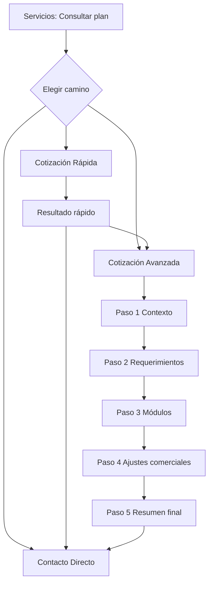

# RFC-003 — UX del Cotizador Web (Flujo Multipaso, Estados y Validaciones)

- **Estado:** Propuesto
- **Fecha:** 2026-05-11
- **Depende de:**
  - `docs/rfc-cotizador-servicios-web.md` (RFC-001)
  - `docs/rfc-cotizador-servicios-web-contratos-datos-api.md` (RFC-002)
- **Repositorio:** `myPortfolio`
- **Ámbito:** Experiencia de usuario, navegación, estados, mensajes y criterios de usabilidad

---

## 1. Resumen ejecutivo

Este RFC define cómo debe comportarse la experiencia del cotizador para que sea:

1. **Clara** para usuarios no técnicos.
2. **Confiable** para usuarios que quieren detalle comercial.
3. **Consistente** con el flujo actual de contacto del portfolio.

Se formalizan tres caminos:

- **Cotización avanzada** (multipaso con desglose).
- **Cotización rápida** (pocas preguntas y resultado orientativo).
- **Contacto directo** (sin simulación).

La decisión central de UX es: **progresive disclosure** (mostrar complejidad por capas), evitando saturar al usuario en la primera interacción.

---

## 2. Objetivos UX

## 2.1 Objetivos principales

- Reducir fricción de entrada sin perder calidad comercial.
- Explicar de forma transparente cómo se forma el total.
- Permitir cambio de modo (rápida ⇄ avanzada ⇄ contacto) sin perder contexto.
- Minimizar abandono en pasos críticos.

## 2.2 Objetivos medibles (definición inicial)

- Tasa de finalización modo rápido ≥ 70%.
- Tasa de finalización modo avanzado ≥ 45%.
- Tasa de error bloqueante por paso < 10%.
- Conversión a contacto desde cotizador ≥ conversión histórica de contacto directo.

---

## 3. Perfiles de usuario

| Perfil | Necesidad | Riesgo UX |
|---|---|---|
| Cliente exploratorio | Estimar rápido sin detalle técnico | Abandono si ve demasiados campos |
| Cliente comparativo | Entender por qué cuesta X | Desconfianza si no ve desglose |
| Cliente decidido | Avanzar directo por contacto | Fricción innecesaria si se obliga a cotizar |

---

## 4. Arquitectura de flujo UX

---

## 5. Especificación de modos

## 5.1 Modo Rápido

## Objetivo

Entregar una simulación orientativa con muy baja fricción.

## Entradas mínimas sugeridas

1. Tipo de proyecto.
2. Estado (nuevo/remodelación).
3. Escala aproximada (simple/estándar/avanzado).
4. Urgencia.
5. ¿Requiere ecommerce o integraciones?

## Salida

- Total orientativo de proyecto.
- Mensualidad opcional sugerida.
- Supuestos clave visibles.
- CTA: “Refinar en avanzada” / “Contactar ahora”.

## Regla UX

No exponer detalle técnico profundo en este modo; sí exponer disclaimer de que es una simulación preliminar.

---

## 5.2 Modo Avanzado

## Objetivo

Permitir una simulación defendible comercialmente, alineada con el sistema base.

## Pasos

### Paso 1 — Contexto del proyecto

- Tipo de proyecto, estado, prioridad, objetivo.
- Validación: campos mínimos para cálculo.

### Paso 2 — Requerimientos y alcance

- Checklist simplificado por áreas (negocio, contenido, funcionalidad, infra, plazo).
- Validación: bloquear avance si faltan campos críticos definidos como obligatorios.

### Paso 3 — Selección modular

- Tabla de módulos con `Incluir`, cantidad, complejidad.
- Ayuda contextual por categoría.
- Validación: si `Incluir=Sí`, cantidad>0 y complejidad obligatoria.

### Paso 4 — Ajustes comerciales

- Urgencia, contingencia, margen, descuento, IVA, factor remodelación.
- Mostrar preview de impacto antes de confirmar.

### Paso 5 — Resumen final

- Desglose completo de cálculo.
- Proyecto inicial separado de mensualidad.
- Supuestos, exclusiones, vigencia y forma de pago base.
- CTA final a contacto.

---

## 5.3 Contacto directo

## Objetivo

No perder leads de usuarios que no quieren completar simulación.

## Reglas

- Mantener experiencia actual.
- Si viene desde rápida/avanzada, pre-cargar contexto (modo, tipo de proyecto, total estimado si existe).

---

## 6. Estados de interfaz (state model)

## 6.1 Estado global del cotizador

| Estado | Descripción |
|---|---|
| `idle` | Inicio sin datos |
| `in_progress` | Flujo en curso |
| `validating` | Validación local/remota |
| `calculated` | Resultado disponible |
| `error` | Error recuperable |
| `submitted` | Derivado a contacto/lead |

## 6.2 Estado por paso (avanzada)

| Estado | Uso |
|---|---|
| `locked` | Paso inaccesible por dependencia |
| `active` | Paso actual |
| `completed` | Paso validado |
| `warning` | Paso con datos incompletos no bloqueantes |
| `invalid` | Paso con error bloqueante |

---

## 7. Reglas de navegación

1. No permitir avanzar si hay errores bloqueantes del paso activo.
2. Sí permitir volver a pasos previos sin perder datos.
3. Al cambiar modo (rápida→avanzada), preservar contexto compatible.
4. Si un cambio en paso anterior invalida cálculo, marcar resumen como desactualizado.
5. Si el usuario abandona, conservar borrador local temporal (si la política técnica lo permite).

---

## 8. Estrategia de validaciones UX

## 8.1 Tipos de validación

- **Inline inmediata:** formato y campos obligatorios.
- **Al intentar avanzar:** coherencia del paso.
- **Previa a calcular:** consistencia de dominio.
- **Previa a enviar contacto:** datos de contacto y consentimiento.

## 8.2 Severidad

| Severidad | Comportamiento |
|---|---|
| Info | No bloquea |
| Warning | No bloquea, recomienda ajuste |
| Error | Bloquea avance o cálculo |

---

## 9. Mensajería UX (guía)

## 9.1 Principios de copy

1. Hablar en lenguaje comercial simple.
2. Explicar causa + acción esperada.
3. Evitar tono técnico interno en mensajes de error.

## 9.2 Plantillas de mensaje

- **Error bloqueante:**
  - “Para continuar, definí la complejidad de los módulos marcados como incluidos.”
- **Warning:**
  - “Podés continuar, pero falta validar accesos de dominio/hosting y eso puede afectar plazo.”
- **Info:**
  - “Esta simulación es referencial hasta validar alcance y material del proyecto.”

---

## 10. Resultado y visualización

## 10.1 Bloques del resumen

1. Total proyecto.
2. Mensualidad opcional.
3. Desglose (horas, contingencia, margen, IVA, descuento).
4. Supuestos y exclusiones.
5. Vigencia y forma de pago base.

## 10.2 Reglas visuales

- Mostrar primero total y luego detalle (progresive disclosure).
- Destacar diferencia entre “estimación” y “propuesta final”.
- Etiquetar explícitamente qué parte es opcional.

---

## 11. Accesibilidad y usabilidad

## 11.1 Requisitos mínimos

- Navegación por teclado en todo el flujo.
- Etiquetas claras en inputs/selects.
- Mensajes de error asociados al campo.
- Contraste y jerarquía visual en estados.

## 11.2 Usabilidad

- Evitar tablas gigantes en móvil sin estrategia responsive.
- Mantener barra de progreso de pasos en avanzada.
- Preservar claridad de CTA principal por pantalla.

---

## 12. Telemetría UX (recomendada)

Eventos mínimos:

- `quote_mode_selected`
- `quote_step_viewed`
- `quote_step_validation_failed`
- `quote_calculated`
- `quote_switched_mode`
- `quote_contact_submitted`
- `quote_abandoned`

Objetivo: detectar dónde se cae el usuario y ajustar fricción.

---

## 13. Riesgos UX y mitigaciones

| Riesgo | Impacto | Mitigación |
|---|---|---|
| Demasiados campos en avanzada | Alto abandono | Flujo por pasos + defaults razonables |
| Resultado poco creíble | Baja conversión | Desglose transparente y supuestos claros |
| Confusión entre rápida y avanzada | Medio | Comparación clara de alcances por modo |
| Fricción al contactar | Pérdida de lead | Pre-carga automática y formulario breve |
| Errores ambiguos | Frustración | Mensajes orientados a acción |

---

## 14. Backlog de tareas UX

## Fase 1 — Diseño de flujo

- [ ] Definir mapa final de pantallas por modo.
- [ ] Definir estructura de pasos y estados.
- [ ] Definir reglas de transición entre modos.

## Fase 2 — Validaciones y mensajes

- [ ] Definir catálogo de validaciones por paso.
- [ ] Definir copy de errores/warnings/infos.
- [ ] Definir comportamiento ante datos incompletos.

## Fase 3 — Resumen y conversiones

- [ ] Definir layout del resumen final.
- [ ] Definir CTA principal y secundarios por modo.
- [ ] Definir payload mínimo a contacto.

## Fase 4 — Accesibilidad y medición

- [ ] Definir checklist de accesibilidad por pantalla.
- [ ] Definir eventos de telemetría.
- [ ] Definir criterios de éxito UX post-lanzamiento.

---

## 15. Criterios de aceptación del RFC

- [ ] Existe acuerdo en la estructura de modos y pasos.
- [ ] Existe acuerdo en reglas de navegación y bloqueo.
- [ ] Existe acuerdo en validaciones y mensajería.
- [ ] Existe acuerdo en presentación del resumen y CTA de conversión.

---

## 16. Próximo paso recomendado

Con RFC-001/002/003 aprobados, crear un **plan de ejecución técnico por incrementos** (slices de implementación) que priorice:

1. Contacto enriquecido + modo rápido primero.
2. Motor canónico y paridad de reglas.
3. Modo avanzado completo y trazabilidad total.
