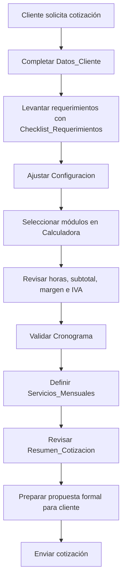
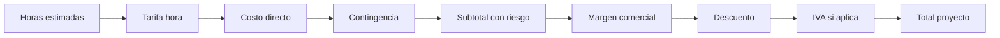
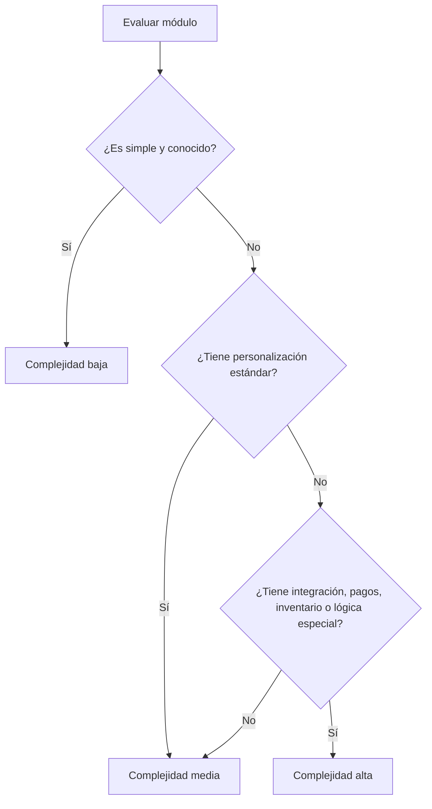
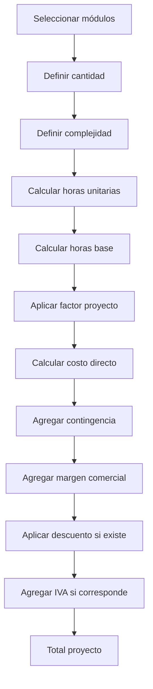
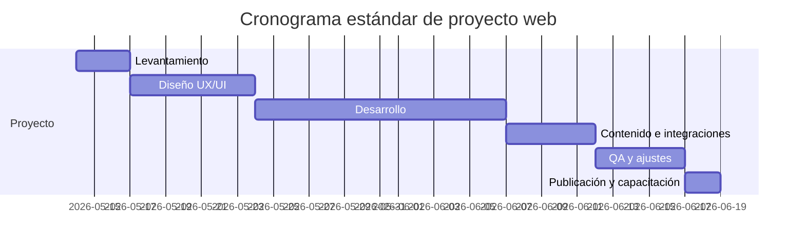
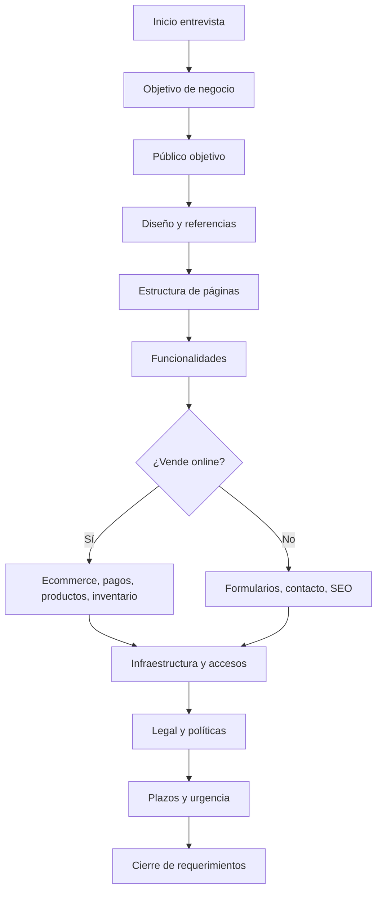
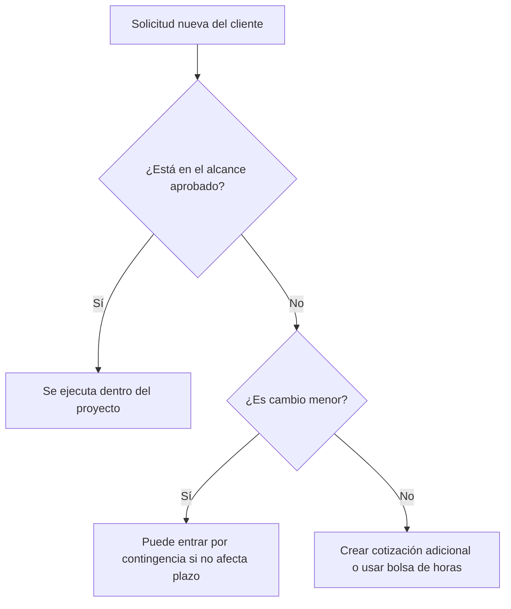

# Manual profesional — Plantilla madre de cotizaciones web

**Versión:** 1.0  
**Uso recomendado:** cotizaciones web para clientes de Chile y Latinoamérica  
**Base de trabajo:** `plantilla_madre_cotizaciones_web.xlsx`  
**Autor comercial:** A&V Devs / Mr Monkey  

---

## 1. Objetivo del manual

Este manual explica cómo usar, mantener, escalar y adaptar la **plantilla madre de cotizaciones web** para distintos tipos de clientes y proyectos digitales.

La planilla fue diseñada para que puedas cotizar de forma consistente proyectos como:

- Landing pages.
- Sitios corporativos.
- Catálogos digitales.
- E-commerce.
- Remodelaciones web.
- Reservas y agendas.
- Formularios avanzados.
- Integraciones con pasarelas de pago.
- SEO inicial.
- Soporte mensual.
- Marketing y redes sociales.
- Bolsas de horas evolutivas.

La idea principal es que cada cotización deje de depender solamente de “intuición” y pase a construirse con un método profesional basado en:

1. Alcance.
2. Módulos.
3. Cantidad.
4. Complejidad.
5. Horas.
6. Factores comerciales.
7. Riesgo.
8. Margen.
9. Impuestos.
10. Servicios mensuales opcionales.

---

## 2. Filosofía de uso

La plantilla no debe verse solo como una calculadora de precios. Debe usarse como una herramienta comercial, técnica y estratégica.

Sirve para:

- Ordenar una entrevista con el cliente.
- Evitar olvidar módulos importantes.
- Justificar valores de forma profesional.
- Comparar escenarios simples, medios y avanzados.
- Separar proyecto inicial de mantención mensual.
- Calcular tiempos estimados.
- Estandarizar propuestas entre clientes.
- Escalar el negocio sin rehacer cada cotización desde cero.

---

## 3. Flujo general de trabajo



---

## 4. Orden recomendado para llenar la planilla

Usa este orden para evitar errores:

| Orden | Hoja | Acción principal |
|---:|---|---|
| 1 | `Datos_Cliente` | Registrar información del cliente y proyecto |
| 2 | `Checklist_Requerimientos` | Entrevistar y completar necesidades |
| 3 | `Configuracion` | Ajustar valores comerciales y factores |
| 4 | `Catalogo_Modulos` | Revisar o agregar módulos si falta alguno |
| 5 | `Calculadora` | Seleccionar módulos, cantidades y complejidad |
| 6 | `Cronograma` | Ajustar fases y duración |
| 7 | `Servicios_Mensuales` | Definir mantención, SEO, redes o soporte |
| 8 | `Resumen_Cotizacion` | Revisar resultado final y copiar a propuesta |

---

# 5. Explicación hoja por hoja

---

## 5.1 Hoja `README`

### Propósito

La hoja `README` funciona como portada interna de la planilla. Resume el objetivo, el flujo recomendado y la lógica general de cálculo.

### Cuándo se usa

Se usa al abrir la plantilla, especialmente cuando:

- Quieres recordar el flujo correcto.
- Compartes la planilla con otro integrante del equipo.
- Creas una copia para un nuevo cliente.
- Necesitas explicar rápidamente cómo funciona el archivo.

### Campos principales

| Campo | Explicación |
|---|---|
| Objetivo | Describe para qué sirve la planilla |
| Flujo recomendado | Indica el orden correcto de uso |
| Regla práctica | Resume cómo se calcula la cotización |
| Uso comercial | Explica el valor de usar esta plantilla |
| Importante | Recuerda que los valores deben calibrarse |
| Hojas incluidas | Lista las hojas principales |

### Buenas prácticas

No modifiques esta hoja en cada cotización. Úsala como documentación permanente de la plantilla.

Puedes actualizarla solo cuando:

- Cambie el método de cálculo.
- Agregues nuevas hojas.
- Cambies el flujo comercial.
- Incorpores nuevos servicios.

### Ejemplo de uso

Cuando un nuevo colaborador te ayude a cotizar, primero debe leer esta hoja para entender el proceso antes de tocar precios o fórmulas.

---

## 5.2 Hoja `Datos_Cliente`

### Propósito

Esta hoja centraliza la información comercial básica del cliente y del proyecto.

Sirve para que la cotización tenga contexto y no quede como un cálculo aislado.

### Estructura general

| Campo | Uso |
|---|---|
| Fecha cotización | Fecha en que se prepara la propuesta |
| Responsable | Persona que prepara la cotización |
| Cliente / Empresa | Nombre comercial o razón social |
| RUT | RUT del cliente o empresa, si aplica |
| Contacto | Persona con la que se coordina |
| Email | Correo de contacto |
| Teléfono | Número de contacto |
| Ciudad / País | Ubicación principal |
| Tipo de proyecto | Landing, corporativa, ecommerce, catálogo, etc. |
| Estado actual | Nuevo, remodelación o mejora |
| Dominio | Dominio existente o por contratar |
| Hosting | Hosting del cliente, nuevo o no definido |
| Sitio actual | URL actual, si existe |
| Referencia visual | Sitios de inspiración entregados por el cliente |
| Objetivo principal | Qué quiere lograr el cliente |
| Fecha deseada | Fecha tentativa de publicación |
| Público objetivo | A quién va dirigido el sitio |
| Prioridad | Baja, media, alta o urgente |
| Observaciones comerciales | Notas visibles para el negocio |
| Notas internas | Notas técnicas o estratégicas internas |

### Cómo llenarla correctamente

Primero completa los datos más objetivos:

```text
Cliente / Empresa: Joyería Rímini
Tipo de proyecto: Remodelación ecommerce
Estado actual: Remodelación
Dominio: joyeriarimini.cl
Hosting: Cliente
Referencia visual: konsens.cl
Prioridad: Alta
```

Luego completa los datos estratégicos:

```text
Objetivo principal:
Modernizar la tienda online, mejorar la experiencia de compra,
ordenar el catálogo de productos y aumentar la confianza visual
para ventas digitales.
```

### Reglas comerciales

- Si el cliente ya tiene dominio y hosting, no cobres esos ítems como si fueran nuevos.
- Si el sitio actual está mal construido, no asumas que todo es reutilizable.
- Si el cliente pide “solo rediseño”, revisa si realmente implica rediseñar, reestructurar, migrar, corregir SEO, rehacer formularios y ordenar contenido.
- Si la fecha deseada es muy ajustada, debes activar factor de urgencia en `Configuracion`.

### Ejemplo práctico

| Campo | Ejemplo |
|---|---|
| Tipo de proyecto | E-commerce |
| Estado actual | Remodelación |
| Sitio actual | `https://www.cliente.cl` |
| Referencia visual | `https://www.referencia.cl` |
| Objetivo principal | Mejorar conversión y estética premium |
| Prioridad | Alta |

---

## 5.3 Hoja `Configuracion`

### Propósito

Esta hoja controla los parámetros económicos y comerciales de toda la cotización.

Es una de las hojas más importantes, porque desde aquí se define la lógica base de precios.

### Campos principales

| Parámetro | Qué controla |
|---|---|
| Tarifa hora base | Valor interno de una hora de trabajo |
| Factor complejidad baja | Multiplicador para tareas simples |
| Factor complejidad media | Multiplicador para tareas estándar |
| Factor complejidad alta | Multiplicador para tareas complejas |
| Factor urgencia normal | Multiplicador para plazo normal |
| Factor urgencia alta | Multiplicador para proyectos urgentes |
| Contingencia | Colchón por riesgo, cambios menores o imprevistos |
| Margen comercial | Ganancia de empresa sobre el costo estimado |
| IVA | Impuesto, si corresponde |
| Aplicar IVA | Controla si se suma IVA al total |
| Descuento comercial | Descuento opcional |
| Factor remodelación | Ajuste cuando el cliente ya tiene sitio, dominio o hosting |

### Fórmula conceptual



### Explicación de cada parámetro

#### Tarifa hora base

Representa el valor interno de una hora de trabajo.

Ejemplo:

```text
Tarifa hora base: $18.000 CLP/h
```

No significa que el cliente verá necesariamente este valor por hora. Es una base interna para calcular.

Puede subir si:

- El proyecto requiere backend.
- Hay integraciones complejas.
- Hay urgencia.
- Hay diseño avanzado.
- Hay responsabilidad comercial alta.
- Hay riesgo técnico.

---

#### Factor complejidad baja

Usar cuando el módulo es simple.

Ejemplos:

- Botón de WhatsApp.
- Página informativa simple.
- Ajuste visual menor.
- Carga de una sección básica.

Valor recomendado:

```text
1.00
```

---

#### Factor complejidad media

Usar para proyectos estándar.

Ejemplos:

- Sitio corporativo personalizado.
- Landing completa con varias secciones.
- Formulario con validaciones.
- SEO técnico básico.
- Home personalizada.

Valor recomendado:

```text
1.20
```

---

#### Factor complejidad alta

Usar cuando hay mayor riesgo o personalización.

Ejemplos:

- E-commerce.
- Pasarela de pagos.
- Reservas.
- Inventario.
- Integraciones externas.
- Automatizaciones.
- Panel administrativo.
- Migraciones.

Valor recomendado:

```text
1.45
```

---

#### Factor urgencia

Se aplica cuando el cliente necesita el proyecto en menos tiempo del razonable.

Ejemplo:

```text
Factor urgencia alta: 1.25
```

No todos los proyectos urgentes deben aceptarse. La urgencia aumenta:

- Riesgo de errores.
- Trabajo fuera de horario.
- Reuniones más intensas.
- Menor margen de validación.
- Mayor presión operativa.

---

#### Contingencia

La contingencia cubre imprevistos razonables.

Ejemplos:

- Cambios pequeños.
- Ajustes responsive.
- Problemas de hosting.
- Contenido incompleto.
- Accesos entregados tarde.
- Diferencias entre lo conversado y lo entregado.

Valor recomendado:

```text
10% a 20%
```

En la plantilla base:

```text
12%
```

---

#### Margen comercial

El margen comercial representa la ganancia de la empresa.

No debe confundirse con la tarifa hora.

La tarifa hora calcula costo base.  
El margen permite sostener el negocio.

Incluye:

- Administración.
- Ventas.
- Riesgo.
- Herramientas.
- Tiempo no facturable.
- Soporte pre/post venta.
- Crecimiento de la empresa.

Valor recomendado:

```text
20% a 35%
```

En la plantilla base:

```text
25%
```

---

#### IVA

En Chile, si corresponde emitir factura afecta, se debe considerar IVA.

Valor de referencia:

```text
19%
```

La celda `Aplicar IVA` permite decidir si el total final lo incluye o no.

---

#### Descuento comercial

Usar solo cuando tenga sentido estratégico.

Ejemplos:

- Cliente recurrente.
- Proyecto vitrina.
- Pago anticipado.
- Paquete con mantención mensual.
- Relación comercial de largo plazo.

Recomendación:

No abuses del descuento. Es mejor ajustar alcance antes que bajar precio sin justificación.

---

#### Factor remodelación

Se usa cuando el cliente ya tiene una página existente.

Ejemplo:

```text
Factor remodelación: 0.85
```

Esto significa que, en teoría, parte del trabajo podría reutilizarse.

Pero cuidado: una remodelación puede ser más compleja que crear desde cero si:

- El sitio está mal construido.
- No hay accesos claros.
- La plataforma es limitada.
- Hay errores previos.
- El contenido está desordenado.
- El SEO está dañado.
- Hay que migrar productos.
- Hay que rehacer diseño y estructura.

### Recomendación para factor remodelación

| Situación | Factor sugerido |
|---|---:|
| Solo ajustes visuales menores | 0.75 |
| Rediseño parcial con contenido reutilizable | 0.85 |
| Remodelación fuerte con estructura nueva | 0.95 |
| Sitio existente no reutilizable | 1.00 |
| Sitio antiguo que complica el trabajo | 1.10 |

---

## 5.4 Hoja `Catalogo_Modulos`

### Propósito

Esta hoja funciona como una biblioteca de módulos reutilizables.

Sirve para no inventar la cotización desde cero cada vez.

Cada módulo tiene:

- Categoría.
- Nombre.
- Descripción.
- Horas para complejidad baja.
- Horas para complejidad media.
- Horas para complejidad alta.
- Entregable.
- Tipo de proyecto al que aplica.
- Notas.
- Fuente o referencia, si corresponde.

### Columnas principales

| Columna | Explicación |
|---|---|
| Categoría | Agrupa el módulo |
| Módulo | Nombre corto del ítem cotizable |
| Descripción | Qué incluye |
| Horas baja | Estimación para caso simple |
| Horas media | Estimación estándar |
| Horas alta | Estimación avanzada |
| Entregable | Qué recibe el cliente |
| Aplica a | Tipo de proyecto compatible |
| Notas | Consideraciones internas |
| Fuente/Referencia | URL o documentación si aplica |

### Categorías base

La plantilla incluye categorías como:

- Base.
- Diseño.
- Frontend.
- Contenido.
- SEO.
- Legal.
- Formulario.
- Integración.
- Ecommerce.
- Reservas.
- QA.
- Deploy.

### Ejemplo de módulo

| Campo | Ejemplo |
|---|---|
| Categoría | Ecommerce |
| Módulo | Pasarela de pago |
| Descripción | Integración Webpay, MercadoPago u otra pasarela |
| Horas baja | 8 |
| Horas media | 16 |
| Horas alta | 30 |
| Entregable | Pago integrado |
| Aplica a | Ecommerce |
| Notas | Puede requerir ambiente producción |

### Cómo agregar un nuevo módulo

Cuando un cliente pida algo que no existe en el catálogo, crea una nueva fila.

Ejemplo:

```text
Categoría: Integración
Módulo: Integración con ERP
Descripción: Conexión entre sitio web y sistema interno de inventario/ventas
Horas baja: 12
Horas media: 28
Horas alta: 60
Entregable: Sincronización básica validada
Aplica a: Ecommerce / Operación
Notas: Requiere documentación técnica del ERP
```

### Reglas para estimar horas

Usa estos criterios:

| Complejidad | Cuándo usarla |
|---|---|
| Baja | El requerimiento es claro, simple y conocido |
| Media | Requiere diseño personalizado o configuración estándar |
| Alta | Requiere lógica, integración, riesgo técnico o pruebas intensivas |

### Diagrama de decisión para complejidad



---

## 5.5 Hoja `Calculadora`

### Propósito

Esta es la hoja principal para calcular el valor del proyecto.

Aquí seleccionas qué módulos se incluirán, cuántas unidades se requieren, qué complejidad tendrá cada módulo y cuál será el costo final.

### Columnas principales

| Columna | Función |
|---|---|
| Incluir | Define si el módulo entra o no en la cotización |
| Categoría | Grupo del módulo |
| Módulo | Nombre del módulo |
| Cantidad | Número de unidades |
| Complejidad | Baja, Media o Alta |
| Horas unitarias | Horas por unidad según complejidad |
| Horas base | Cantidad x horas unitarias |
| Factor proyecto | Factor de remodelación u otro ajuste |
| Horas ajustadas | Horas base x factor proyecto |
| Costo base | Horas ajustadas x tarifa hora |
| Observación | Nota comercial/técnica |
| Entregable | Qué se entrega |
| Prioridad | Alta, media o baja |

### Valores típicos para `Incluir`

| Valor | Significado |
|---|---|
| Sí | Se incluye en el cálculo |
| Opcional | Se muestra pero no suma si la fórmula lo trata como no incluido |
| No | No se considera |

### Ejemplo 1: landing page simple

| Módulo | Incluir | Cantidad | Complejidad |
|---|---|---:|---|
| Levantamiento de requerimientos | Sí | 1 | Baja |
| Dirección visual | Sí | 1 | Baja |
| UI Home personalizada | Sí | 1 | Media |
| Maquetación responsive | Sí | 1 | Media |
| Formulario de contacto | Sí | 1 | Baja |
| SEO técnico básico | Sí | 1 | Baja |
| Publicación y traspaso | Sí | 1 | Baja |

### Ejemplo 2: web corporativa estándar

| Módulo | Incluir | Cantidad | Complejidad |
|---|---|---:|---|
| Levantamiento de requerimientos | Sí | 1 | Media |
| Arquitectura de información | Sí | 1 | Media |
| Dirección visual | Sí | 1 | Media |
| UI Home personalizada | Sí | 1 | Media |
| Diseño de vistas internas | Sí | 5 | Media |
| Maquetación responsive | Sí | 1 | Media |
| Carga de contenido | Sí | 1 | Media |
| Formulario de contacto | Sí | 1 | Media |
| Analytics y tracking | Sí | 1 | Media |
| QA | Sí | 1 | Media |
| Publicación y traspaso | Sí | 1 | Media |

### Ejemplo 3: e-commerce

| Módulo | Incluir | Cantidad | Complejidad |
|---|---|---:|---|
| Catálogo de productos | Sí | 1 | Media |
| Carrito y checkout | Sí | 1 | Media |
| Pasarela de pago | Sí | 1 | Media |
| Carga inicial de productos | Sí | 3 | Media |
| Gestión de inventario | Sí | 1 | Media |
| Páginas legales | Sí | 1 | Media |
| SEO técnico básico | Sí | 1 | Media |
| QA | Sí | 1 | Alta |

### Fórmulas conceptuales

#### Horas base

```text
Horas base = Cantidad x Horas unitarias
```

#### Horas ajustadas

```text
Horas ajustadas = Horas base x Factor proyecto
```

#### Costo base

```text
Costo base = Horas ajustadas x Tarifa hora base
```

#### Subtotal con contingencia

```text
Subtotal con contingencia = Costo directo + Contingencia
```

#### Subtotal neto

```text
Subtotal neto = Subtotal con contingencia + Margen comercial - Descuento
```

#### Total con IVA

```text
Total con IVA = Subtotal neto + IVA
```

### Diagrama del cálculo



### Cómo usar la sección de resumen

En la parte inferior de la hoja aparece un resumen con indicadores como:

- Horas base.
- Horas ajustadas.
- Costo directo.
- Contingencia.
- Subtotal con contingencia.
- Margen comercial.
- Descuento.
- Subtotal neto.
- IVA.
- Total proyecto.

Estos valores alimentan el resumen ejecutivo.

### Errores comunes

| Error | Consecuencia | Solución |
|---|---|---|
| Dejar cantidad en 0 | El módulo no suma | Revisar cantidad |
| Marcar módulo como opcional pero esperar que sume | Puede quedar fuera del total | Cambiar a Sí |
| Usar complejidad baja en pagos/integraciones | Subestima el trabajo | Usar media o alta |
| No incluir QA | Aumenta riesgo post-entrega | Siempre incluir QA |
| No incluir publicación | El proyecto queda sin cierre | Siempre incluir Deploy |
| No considerar contenido | El cliente puede atrasar todo | Definir si lo entrega el cliente o lo cargas tú |

---

## 5.6 Hoja `Cronograma`

### Propósito

Esta hoja estima las fases y tiempos del proyecto.

Permite mostrar al cliente una ruta clara de trabajo y ayuda a ordenar la ejecución.

### Fases incluidas

| Fase | Descripción |
|---|---|
| 1. Levantamiento | Reunión, objetivos, alcance y recopilación de material |
| 2. Diseño UX/UI | Sitemap, dirección visual, vistas clave y validación |
| 3. Desarrollo | Construcción frontend/backend/CMS según alcance |
| 4. Contenido e integraciones | Carga de contenido, SEO, formularios, pagos o integraciones |
| 5. QA y ajustes | Pruebas, correcciones, performance básica y responsive |
| 6. Publicación y capacitación | Deploy, DNS/SSL, entrega, capacitación y cierre |

### Columnas principales

| Columna | Uso |
|---|---|
| Fase | Nombre de la etapa |
| Descripción | Qué se realiza |
| Duración días | Tiempo estimado |
| Inicio estimado | Fecha de inicio |
| Fin estimado | Fecha de cierre |
| Responsable | Quién participa |
| Entregable | Resultado esperado |
| Estado | Pendiente, en proceso, aprobado, bloqueado |

### Diagrama de fases



### Cómo adaptar tiempos

| Tipo de proyecto | Tiempo sugerido |
|---|---:|
| Landing simple | 5 a 10 días hábiles |
| Web corporativa estándar | 15 a 25 días hábiles |
| Catálogo | 20 a 35 días hábiles |
| E-commerce estándar | 25 a 45 días hábiles |
| E-commerce con integraciones | 45 a 90 días hábiles |
| Sistema web a medida | 60+ días hábiles |

### Regla importante

Nunca prometas fecha final sin validar:

- Entrega de textos.
- Entrega de imágenes.
- Logo y marca.
- Accesos a dominio/hosting.
- Accesos a pasarela de pago.
- Validación legal.
- Stock/productos.
- Revisión y aprobación del cliente.

---

## 5.7 Hoja `Servicios_Mensuales`

### Propósito

Esta hoja separa el valor del proyecto inicial de los servicios recurrentes.

Es clave para transformar una cotización puntual en una relación mensual.

### Servicios incluidos en la plantilla

| Servicio | Plan | Valor base |
|---|---|---:|
| Mantenimiento | Esencial | $85.000/mes |
| SEO | SEO Local | $100.000/mes |
| Redes sociales | Plan Emprendedor | $350.000/mes |
| Bolsa de horas | Soporte evolutivo | Editable |

### Columnas principales

| Columna | Explicación |
|---|---|
| Incluir | Sí, opcional o no |
| Servicio | Tipo de servicio mensual |
| Plan | Nombre comercial |
| Valor mensual | Precio mensual |
| Horas incluidas | Referencia operativa |
| SLA | Tiempo/respuesta o frecuencia |
| Entregables | Qué incluye |
| Observaciones | Notas comerciales |
| Total mensual | Valor que suma según selección |

### Ejemplo de paquete mensual básico

```text
Mantenimiento Esencial: $85.000/mes
SEO Local: Opcional
Redes sociales: Opcional
Total mensual seleccionado: $85.000
```

### Ejemplo de paquete mensual para ecommerce

```text
Mantenimiento Esencial: $85.000/mes
SEO Local: $100.000/mes
Bolsa de horas: $180.000/mes
Total mensual seleccionado: $365.000
```

### Recomendación comercial

Ofrece siempre al menos una mantención básica.

Un sitio web sin mantención puede sufrir:

- Plugins desactualizados.
- Formularios rotos.
- Problemas de seguridad.
- Errores por cambios del hosting.
- Pérdida de posicionamiento.
- Caídas no detectadas.
- Contenido desactualizado.

### Diferencia entre mantenimiento y cambios evolutivos

| Tipo | Incluye | No incluye |
|---|---|---|
| Mantenimiento | Actualizaciones, revisión básica, seguridad, soporte menor | Nuevas secciones grandes, rediseños, integraciones |
| Bolsa de horas | Mejoras, ajustes, nuevas funciones pequeñas | Sistemas complejos o desarrollos mayores |

---

## 5.8 Hoja `Resumen_Cotizacion`

### Propósito

Esta hoja entrega una vista ejecutiva del resultado final.

Sirve para copiar datos a una propuesta formal, PDF, correo o presentación comercial.

### Campos principales

| Campo | Uso |
|---|---|
| Cliente | Nombre del cliente |
| Proyecto | Tipo de proyecto |
| Fecha | Fecha de cotización |
| Objetivo | Objetivo comercial |
| Referencia | Sitio o estilo de referencia |
| Prioridad | Nivel de prioridad |
| Horas base estimadas | Horas sin todos los ajustes |
| Horas ajustadas | Horas con factor de proyecto |
| Subtotal neto | Valor antes de IVA |
| IVA | Impuesto calculado si aplica |
| TOTAL PROYECTO | Total estimado |
| Mensualidad opcional | Servicios mensuales seleccionados |
| Alcance recomendado | Texto base para propuesta |

### Cómo usarlo en una propuesta

Puedes copiar esta información a un documento más formal con estructura:

```text
Estimado cliente:

De acuerdo con la reunión y los requerimientos levantados,
se propone el desarrollo/remodelación del sitio web bajo el
siguiente alcance:

[Alcance recomendado]

Valor proyecto:
Subtotal neto: $X
IVA: $X
Total: $X

Servicios mensuales opcionales:
$X mensual

Plazo estimado:
X días hábiles, sujeto a entrega de contenidos y accesos.
```

### Recomendación

No envíes solo la planilla al cliente si no es necesario.

Mejor usa la hoja `Resumen_Cotizacion` como base para preparar:

- PDF de propuesta.
- Correo comercial.
- Documento Word.
- Presentación breve.
- Contrato o anexo de alcance.

---

## 5.9 Hoja `Checklist_Requerimientos`

### Propósito

Esta hoja sirve para hacer la entrevista inicial con el cliente.

Es fundamental para evitar cotizar a ciegas.

### Áreas cubiertas

| Área | Qué busca aclarar |
|---|---|
| Negocio | Objetivo y público |
| Contenido | Textos, fotos, logo y material |
| Diseño | Referencias visuales |
| Estructura | Cantidad de páginas/vistas |
| Funcional | Formularios, reservas, cotizadores |
| Ecommerce | Venta online, pagos, productos |
| Operación | Quién administrará el sitio |
| SEO | Necesidades de posicionamiento |
| Legal | Políticas, privacidad, devoluciones |
| Infra | Dominio, hosting, correos y accesos |
| Integraciones | ERP, CRM, inventario, mailing, WhatsApp |
| Plazo | Urgencia y fecha de lanzamiento |

### Cómo usar el checklist en una reunión

#### Paso 1: partir por negocio

Preguntas clave:

```text
¿Cuál es el objetivo principal del sitio?
¿A quién quiere llegar?
¿Qué problema quiere resolver?
¿Qué acción espera del visitante?
```

#### Paso 2: aterrizar alcance

Preguntas clave:

```text
¿Cuántas páginas necesita?
¿Tiene textos e imágenes?
¿Necesita vender online?
¿Necesita formularios?
¿Necesita reservas?
¿Necesita administrar contenido?
```

#### Paso 3: detectar riesgos

Preguntas clave:

```text
¿Tiene acceso al dominio?
¿Tiene acceso al hosting?
¿Tiene claves de pasarela de pago?
¿Tiene políticas legales?
¿Tiene productos listos?
¿Tiene fotos profesionales?
```

#### Paso 4: validar prioridad

Preguntas clave:

```text
¿Hay una fecha límite real?
¿Qué pasa si el proyecto se retrasa?
¿Hay campaña, evento o lanzamiento asociado?
```

### Estados recomendados

| Estado | Uso |
|---|---|
| Pendiente | Falta responder |
| Respondido | Cliente ya entregó información |
| Bloqueado | Falta acceso, material o decisión |
| Validado | Confirmado y listo para cotizar |
| No aplica | No corresponde al proyecto |

### Diagrama de entrevista



---

# 6. Tipos de proyecto y configuración sugerida

## 6.1 Landing page

### Cuándo aplica

- Campaña puntual.
- Servicio único.
- Captación de leads.
- Página personal/profesional.
- Producto específico.

### Módulos típicos

| Módulo | Complejidad sugerida |
|---|---|
| Levantamiento | Baja/Media |
| Dirección visual | Baja/Media |
| UI Home personalizada | Media |
| Maquetación responsive | Media |
| Formulario de contacto | Baja |
| WhatsApp / CTA | Baja |
| SEO técnico básico | Baja |
| QA | Baja/Media |
| Publicación | Baja |

### Rango sugerido

```text
$300.000 a $900.000 CLP
```

Depende del diseño, copy, animaciones y urgencia.

---

## 6.2 Web corporativa

### Cuándo aplica

- Empresa de servicios.
- Constructora.
- Consultora.
- Pyme profesional.
- Marca que necesita presencia seria.

### Módulos típicos

| Módulo | Complejidad sugerida |
|---|---|
| Arquitectura de información | Media |
| Dirección visual | Media |
| Home | Media |
| Vistas internas | Media |
| Maquetación responsive | Media |
| Contenido | Media |
| Formulario | Media |
| SEO básico | Media |
| Analytics | Media |
| QA | Media |
| Deploy | Media |

### Rango sugerido

```text
$800.000 a $2.500.000 CLP
```

---

## 6.3 Catálogo digital

### Cuándo aplica

- Empresa muestra productos pero no vende online.
- Ferretería, joyería, repuestos, maquinaria, servicios técnicos.
- Catálogo administrable.

### Módulos típicos

| Módulo | Complejidad sugerida |
|---|---|
| Catálogo de productos | Media/Alta |
| Ficha de producto | Media |
| Filtros | Media/Alta |
| Carga inicial | Media |
| WhatsApp / CTA | Baja |
| SEO | Media |
| Analytics | Media |
| QA | Media/Alta |

### Rango sugerido

```text
$1.200.000 a $3.000.000 CLP
```

---

## 6.4 E-commerce

### Cuándo aplica

- Venta online.
- Carrito.
- Checkout.
- Pasarela de pagos.
- Inventario.
- Políticas legales.
- Emails transaccionales.

### Módulos típicos

| Módulo | Complejidad sugerida |
|---|---|
| Catálogo | Media/Alta |
| Carrito y checkout | Media/Alta |
| Pasarela de pago | Media/Alta |
| Gestión de inventario | Media/Alta |
| Carga inicial de productos | Media |
| Páginas legales | Media |
| SEO técnico | Media |
| QA | Alta |
| Deploy | Media/Alta |

### Rango sugerido

```text
$800.000 a $3.500.000+ CLP
```

Si hay ERP, sincronización, facturación, logística o automatizaciones, puede superar ese rango.

---

## 6.5 Sistema web a medida

### Cuándo aplica

- Paneles administrativos.
- Gestión interna.
- Automatizaciones.
- Roles y permisos.
- Reportes.
- Integraciones.
- Bases de datos.
- APIs.

### Recomendación

Para sistemas a medida no basta la plantilla estándar. Usa esta plantilla como base inicial, pero crea además:

- Documento de requerimientos funcionales.
- Documento de requerimientos no funcionales.
- Modelo de datos.
- Diagrama de arquitectura.
- Historias de usuario.
- Roadmap por fases.
- Contrato por hitos.

### Rango sugerido

```text
Desde $2.500.000 CLP hacia arriba
```

---

# 7. Reglas de seguridad comercial

## 7.1 Nunca cotizar sin alcance

Evita frases como:

```text
“Una página web sale $X”
```

Mejor:

```text
“El valor depende del alcance. Para calcularlo correctamente
necesitamos definir vistas, funcionalidades, contenido,
integraciones, urgencia y mantenimiento.”
```

---

## 7.2 Separar proyecto inicial de mensualidad

El desarrollo inicial es una cosa.

El soporte mensual es otra.

Debe quedar separado así:

```text
Proyecto web: $X pago único
Mantenimiento: $Y mensual opcional/recomendado
SEO: $Z mensual opcional
Redes sociales: $W mensual opcional
```

---

## 7.3 Declarar exclusiones

Toda cotización debe indicar qué no incluye.

Ejemplos:

- Compra de dominio.
- Pago de hosting.
- Licencias premium.
- Fotografía profesional.
- Redacción legal especializada.
- Pasarela de pago con costos de terceros.
- Comisiones de Transbank/MercadoPago.
- Campañas pagadas en Google Ads o Meta Ads.
- Carga masiva ilimitada de productos.
- Integraciones no declaradas.
- Cambios mayores fuera del alcance aprobado.

---

## 7.4 Controlar cambios de alcance

Cuando el cliente pida algo nuevo después de aprobar, clasifica:



---

# 8. Cómo escalar la plantilla

## 8.1 Crear copias por cliente

Nunca trabajes sobre la plantilla madre directamente.

Usa esta convención:

```text
COTIZACION_YYYY-MM-DD_CLIENTE_TIPO.xlsx
```

Ejemplos:

```text
COTIZACION_2026-05-11_RIMINI_ECOMMERCE.xlsx
COTIZACION_2026-05-12_BUSES-MARLEY_WEB-CORPORATIVA.xlsx
COTIZACION_2026-05-15_CLINICA-DENTAL_LANDING.xlsx
```

---

## 8.2 Versionado

Cuando hagas cambios importantes:

```text
v1 - Primera cotización enviada
v2 - Ajuste por alcance reducido
v3 - Agrega ecommerce
v4 - Aprobada por cliente
```

Ejemplo:

```text
COTIZACION_2026-05-11_RIMINI_ECOMMERCE_v1.xlsx
COTIZACION_2026-05-11_RIMINI_ECOMMERCE_v2.xlsx
```

---

## 8.3 Control de carpetas

Estructura recomendada:

```text
Cotizaciones/
├── 00_Plantilla_Madre/
│   ├── plantilla_madre_cotizaciones_web.xlsx
│   └── manual_plantilla_madre_cotizaciones_web.md
├── 2026/
│   ├── 05_Mayo/
│   │   ├── Rimini/
│   │   │   ├── v1/
│   │   │   ├── v2/
│   │   │   └── propuesta_pdf/
│   │   └── Cliente_X/
│   └── 06_Junio/
└── Recursos/
    ├── precios_base.md
    ├── clausulas_comerciales.md
    └── checklist_reunion.md
```

---

# 9. Plantilla de entrevista rápida

Puedes usar este guion antes de llenar la planilla:

```markdown
## Entrevista inicial para cotización web

### 1. Negocio
- ¿Cuál es el objetivo principal del sitio?
- ¿Qué problema quiere resolver?
- ¿Quién es el público objetivo?
- ¿Qué acción espera que haga el visitante?

### 2. Estado actual
- ¿Tiene sitio web?
- ¿Tiene dominio?
- ¿Tiene hosting?
- ¿Tiene correos corporativos?
- ¿Tiene accesos disponibles?

### 3. Diseño
- ¿Tiene logo?
- ¿Tiene paleta de colores?
- ¿Tiene referencias visuales?
- ¿Qué sitios le gustan?
- ¿Qué sitios no le gustan?

### 4. Contenido
- ¿Tiene textos?
- ¿Tiene fotografías?
- ¿Tiene videos?
- ¿Tiene catálogo?
- ¿Quién entregará el contenido?

### 5. Funcionalidades
- ¿Necesita formulario?
- ¿Necesita WhatsApp?
- ¿Necesita reservas?
- ¿Necesita vender online?
- ¿Necesita pagos?
- ¿Necesita panel administrador?

### 6. Ecommerce
- ¿Cuántos productos tendrá?
- ¿Los productos tienen variaciones?
- ¿Maneja stock?
- ¿Necesita despacho?
- ¿Qué medio de pago usará?
- ¿Tiene políticas de cambios/devoluciones?

### 7. Marketing
- ¿Necesita SEO?
- ¿Tiene Google Business Profile?
- ¿Usa redes sociales?
- ¿Tiene campañas activas?
- ¿Necesita contenido mensual?

### 8. Plazos y presupuesto
- ¿Tiene fecha límite?
- ¿Tiene presupuesto aproximado?
- ¿Quién aprueba la cotización?
- ¿Cuándo esperan comenzar?
```

---

# 10. Checklist antes de enviar una cotización

Antes de enviar, revisa:

| Revisión | Estado |
|---|---|
| Datos del cliente completos | ☐ |
| Objetivo claro | ☐ |
| Tipo de proyecto definido | ☐ |
| Estado actual definido | ☐ |
| Módulos seleccionados correctamente | ☐ |
| Cantidades revisadas | ☐ |
| Complejidades revisadas | ☐ |
| QA incluido | ☐ |
| Publicación incluida | ☐ |
| Contingencia aplicada | ☐ |
| Margen comercial aplicado | ☐ |
| IVA revisado | ☐ |
| Servicios mensuales revisados | ☐ |
| Cronograma realista | ☐ |
| Exclusiones redactadas | ☐ |
| Forma de pago definida | ☐ |
| Vigencia de cotización definida | ☐ |

---

# 11. Recomendación de forma de pago

Para proyectos web, se recomienda no iniciar sin anticipo.

## Opción estándar

```text
50% para iniciar
50% antes de publicación
```

## Opción por hitos

```text
40% inicio
30% diseño aprobado
30% antes de publicación
```

## Opción ecommerce o proyecto grande

```text
30% inicio
30% diseño/arquitectura aprobada
25% versión funcional
15% antes de publicación
```

---

# 12. Cláusulas recomendadas para propuesta

Puedes usar estas cláusulas en tus documentos comerciales.

## Vigencia

```text
La presente cotización tiene una vigencia de 10 días corridos
desde su fecha de emisión.
```

## Alcance

```text
El alcance considerado corresponde exclusivamente a los módulos,
vistas, funcionalidades y servicios descritos en esta propuesta.
Cualquier requerimiento adicional será evaluado y cotizado por separado.
```

## Contenido

```text
El cliente será responsable de entregar textos, imágenes, logos,
accesos y material necesario para la correcta ejecución del proyecto,
salvo que se indique expresamente lo contrario.
```

## Plazos

```text
Los plazos estimados dependen de la entrega oportuna de información,
validaciones, accesos y aprobaciones por parte del cliente.
```

## Pagos de terceros

```text
No se incluyen costos de dominio, hosting, licencias, plugins premium,
pasarelas de pago, comisiones bancarias, campañas publicitarias ni otros
servicios de terceros, salvo que se indique expresamente.
```

## Cambios

```text
Cambios menores podrán ser absorbidos dentro de la contingencia técnica
siempre que no modifiquen el alcance, plazo o complejidad del proyecto.
Cambios mayores serán cotizados por separado.
```

---

# 13. Mantenimiento de la plantilla madre

Cada cierto tiempo revisa:

| Frecuencia | Acción |
|---|---|
| Mensual | Revisar tarifas y servicios mensuales |
| Trimestral | Ajustar horas por experiencia real |
| Semestral | Actualizar módulos y exclusiones |
| Anual | Revisar estrategia de precios completa |

### Qué medir después de cada proyecto

Registra internamente:

- Horas cotizadas.
- Horas reales.
- Diferencia de margen.
- Cambios de alcance.
- Problemas comunes.
- Tipo de cliente.
- Nivel de satisfacción.
- Tiempo de pago.
- Rentabilidad final.

Con esos datos puedes mejorar la plantilla.

---

# 14. Indicadores para mejorar el negocio

Puedes agregar en futuras versiones una hoja de análisis con:

| Indicador | Fórmula conceptual |
|---|---|
| Margen real | Ganancia real / precio vendido |
| Desviación de horas | Horas reales - horas cotizadas |
| Rentabilidad por cliente | Total cobrado - costo real |
| Tasa de aprobación | Cotizaciones aceptadas / cotizaciones enviadas |
| Ticket promedio | Ventas totales / proyectos vendidos |
| Ingreso recurrente mensual | Total mensualidades activas |

---

# 15. Reglas finales de uso profesional

1. No trabajes sobre la plantilla madre original.
2. Crea una copia por cliente.
3. Completa primero datos y requerimientos.
4. No cotices sin revisar alcance.
5. No vendas ecommerce como web simple.
6. No incluyas integraciones sin validar documentación.
7. No prometas plazos sin accesos ni contenido.
8. No regales mantenimiento.
9. No escondas costos de terceros.
10. Siempre separa proyecto inicial y servicios mensuales.
11. Siempre incluye QA y publicación.
12. Siempre declara exclusiones.
13. Siempre deja vigencia de cotización.
14. Siempre protege el margen.
15. Siempre documenta cambios de alcance.

---

## 16. Resumen ejecutivo

La plantilla madre permite convertir el proceso de cotización web en un sistema profesional, repetible y escalable.

Bien usada, te ayuda a:

- Cotizar más rápido.
- Evitar errores.
- Justificar precios.
- Vender mantenimiento.
- Separar alcance de extras.
- Profesionalizar tu marca.
- Prepararte para crecer con más clientes o colaboradores.

La clave no es llenar la planilla rápido.  
La clave es usarla como un proceso ordenado de diagnóstico, estimación, propuesta y control comercial.

---
