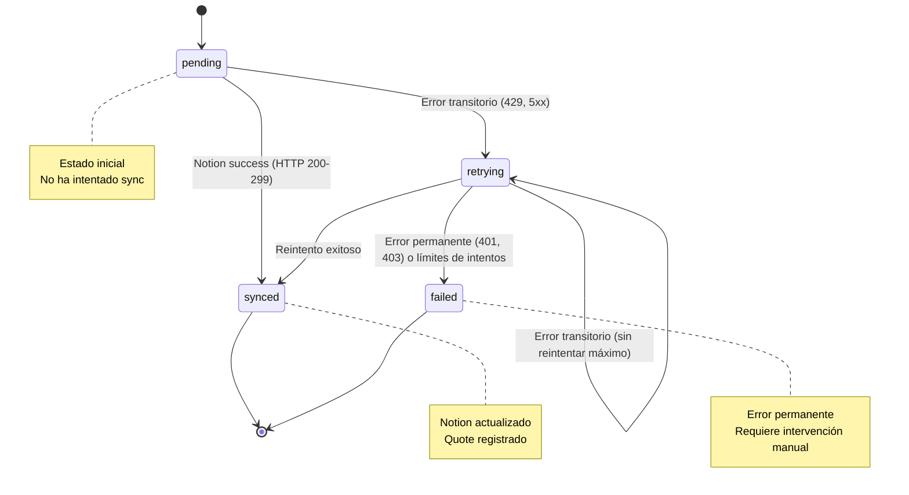

# Spec: Sprint 2 - Escalamiento con Persistencia Híbrida (SQLite + Notion)

## Summary

Esta especificación define la arquitectura de persistencia híbrida para QuoteRecords, implementando:
1. **SQLite como source of truth** y punto de lectura/escritura principal
2. **Sync asíncrono a Notion** con estados transicionales y retry logic
3. **Paridad PHP** (`enviar.php`) para despliegues en cPanel

---

## Contexto del Problema

El cotizador actual (Sprint 1) responde inmediatamente al cliente sin persistir datos. Con el crecimiento esperado de tráfico, esto genera:

- ❌ **Data loss**: Quotes no guardados si el servidor falla
- ❌ **Sin historial**: Imposibilidad de auditar o recuperar quotes pasados
- ❌ **Bloqueo en cálculo**: Clientes deben esperar hasta completar cálculos complejos
- ❌ **No hay analytics**: Sin métricas históricas para mejorar el producto

---

## Solución Propuesta

### Arquitectura

```
┌─────────────────────────────────────────────────────────────┐
│                     Frontend (React)                         │
└────────────────────────────┬────────────────────────────────┘
                             │
┌────────────────────────────▼────────────────────────────────┐
│              API Layer (Node.js + Express)                   │
│                                                             │
│  POST /api/quotes/simulate                                  │
└────────────────────────────┬────────────────────────────────┘
                             │
        ┌────────────────────┴────────────────────┐
        │                                         │
        ▼                                         ▼
┌───────────────────┐                   ┌───────────────────┐
│  SQLite Database  │                   │  Notion API       │
│  (Source of Truth)│                   │  (Async Sync)     │
└───────────────────┘                   └───────────────────┘
```

---

## Requisitos Funcionales

### F1: Esquema SQLite `QuoteRecord` v1

#### Tabla: `quotes`

| Columna | Tipo | Constraint | Descripción |
|---------|------|------------|-------------|
| `quote_id` | TEXT | PRIMARY KEY | ID único del quote (formato: `qt_<uuid>`) |
| `trace_id` | TEXT | UNIQUE NOT NULL | Trace ID para debugging (formato: `trc_<uuid>`) |
| `schema_version` | TEXT | NOT NULL | Versión del esquema (ej: `1.0.0`) |
| `pricing_config_version` | TEXT | NOT NULL | Versión de la config de pricing usada |
| `origin` | TEXT | NOT NULL | Origen del request (`advanced`, `basic`, `api`) |
| `project_type` | TEXT | NOT NULL | Tipo de proyecto (`website`, `mobile-app`, `saas`, etc.) |
| `project_state` | TEXT | NOT NULL | Estado detectado del proyecto (líneas, componentes, etc.) |
| `currency` | TEXT | NOT NULL | Moneda de cotización |
| `input_json` | TEXT | NOT NULL | Payload original del cliente (raw JSON) |
| `totals_json` | TEXT | NOT NULL | Resultados de `buildTotals()` serializados |
| `meta_json` | TEXT | NOT NULL | Metadata adicionales |
| `created_at` | TEXT | NOT NULL | Timestamp RFC3339 del momento del cálculo |
| `sync_status` | TEXT | DEFAULT 'pending' | Estado del sync: `pending`, `synced`, `failed`, `retrying` |
| `sync_attempts` | INTEGER | DEFAULT 0 | Contador de intentos de sync a Notion |
| `sync_last_error` | TEXT | NULLABLE | Último error en caso de fallas |

#### Índices

```sql
CREATE INDEX idx_quotes_trace_id ON quotes(trace_id);
CREATE INDEX idx_quotes_sync_status ON quotes(sync_status);
CREATE INDEX idx_quotes_created_at ON quotes(created_at);
```

### F2: Endpoint `POST /api/quotes/simulate` - Persistencia Antes de Responder

#### Flujo Requerido

```
1. Recebir payload del cliente
2. Validar esquema (required fields)
3. Calcular totals usando buildTotals()
4. INSERTAR en SQLite (QuoteRecord, sync_status='pending')
5. Devolver 200 OK al cliente
6. Iniciar async job para sync a Notion (después de responder)
```

#### Contracto CRÍTICO

- ⚠️ **SQLite persistencia SÍNCRONA**: El record debe guardarse en DB ANTES de enviar respuesta HTTP al cliente
- ⚠️ **Resposta inmediata**: El cliente recibe 200 OK inmediatamente, sin esperar al sync asíncrono

#### Payload Request

```typescript
interface QuoteRequest {
  trace_id: string;                    // Requerido - Identificador único
  quote_id?: string;                   // Opcional - Genera si no existe
  origin: 'advanced' | 'basic' | 'api';
  project_type: string;                // Requerido
  project_state: ProjectStatePayload;  // Requerido - Output de detect-project-state
  currency: string;                    // Requerido (ej: 'USD', 'EUR', 'PEN')
  budget?: number;
}

interface ProjectStatePayload {
  lines_of_code: number;
  complexity_level: 'low' | 'medium' | 'high';
  features_detected: string[];         // Array de feature IDs
  tech_stack?: Record<string, string>; // Opcional - Tecnologías detectadas
}
```

#### Payload Response

```typescript
interface QuoteResponse {
  success: true;
  quote_id: string;
  trace_id: string;
  created_at: string;                  // RFC3339 ISO 8601
  totals: {
    total_project: number;
    total_monthly: number;
    estimated_min: number;
    estimated_max: number;
    confidence_level: 'low' | 'medium' | 'high';
  };
}
```

#### Implementación Clave

```typescript
// ✅ CORRECTO: Persistir antes de responder
async function simulateQuote(req: QuoteRequest, res: Response) {
  try {
    // Paso 1: Calcular totals
    const totals = await buildTotals(req);
    
    // Paso 2: INSERTAR en SQLite (sync_status='pending')
    await db.execute(`
      INSERT INTO quotes (quote_id, ...) VALUES (?, ...);
    `, values);
    
    // Paso 3: Responder INMEDIATAMENTE al cliente
    res.status(200).json({ success: true, totals });
    
    // Paso 4: SYNC ASÍNCRONO (background job)
    queue.add('syncQuoteToNotion', { quoteId: req.quote_id });
    
  } catch (error) {
    res.status(500).json({ error: 'Internal server error' });
  }
}

// ❌ INCORRECTO: Responder antes de persistir
async function simulateQuoteWrong(req, res) {
  res.status(200).json({ success: true }); // Cliente feliz pero sin guardar!
  
  await db.insert(quote); // ¡Perdido si el servidor cae aquí!
}
```

### F3: Sync Asíncrono a Notion con Estados Transicionales

#### Workflow de Sync



#### Estados de `sync_status`

| Estado | Significado | Valores Admisibles para `sync_attempts` | Acción Requerida |
|--------|-------------|----------|------------------|
| `pending` | No intentado aún | 0 | Iniciar sync background |
| `synced` | Notion actualizado | ¿?¿?¿? (fijo) | ❌ Sin reintentos |
| `failed` | Error permanente | ¿?¿?¿?+1 | Intervención manual requerida |
| `retrying` | Reintentando | 1-3 (incrementa por retry) | Reintentar con backoff |

#### Lógica de Transiciones

```typescript
const SYNC_CONFIG = {
  MAX_RETRIES: 5,             // Máximo intentos totales
  PERMANENT_ERRORS: [401, 403], // Errores sin reintentar (auth)
  TRANSIENT_ERRORS: [429, 500, 502, 503], // Reintentables
  BACKOFF_MULTIPLIER: 2,      // Tiempo de espera x 2 por intento
};

function getSyncStatus(error: ErrorInfo): { status: SyncStatus; attempts: number } {
  if (SYNC_CONFIG.PERMANENT_ERRORS.includes(error.status)) {
    return { 
      status: 'failed', 
      attempts: error.attempts 
    };
  }
  
  // Transitorio sin exceder MAX_RETRIES
  const attempt = error.attempts + 1;
  if (attempt <= SYNC_CONFIG.MAX_RETRIES) {
    return { 
      status: 'retrying', 
      attempts: attempt 
    };
  }
  
  // Máximo agotado
  return { status: 'failed', attempts: SYNC_CONFIG.MAX_RETRIES };
}
```

#### Payload Notion (Payload Actualizado)

El payload enviado a Notion incluye **extracto de totals** para enriquecer las propiedades:

```json
{
  "quote_id": "qt_abc123",
  "trace_id": "trc_def456",
  "created_at": "2026-05-11T08:30:00Z",
  "schema_version": "1.0.0",
  "pricing_config_version": "2026.05.11",
  "origin": "advanced",
  "project_type": "website",
  "total_project": 407836,              // Suma de all line items
  "total_monthly": 85000,               // Plan mensual (si aplica)
  "estimated_min": 367051,
  "estimated_max": 469011,
  "confidence_level": "high"
}
```

#### Notion Properties Mapeo

| QuoteRecord Field | Notion Property Type | Descripción |
|-------------------|---------------------|-------------|
| `quote_id` | Title (selectable) | ID único del quote |
| `trace_id` | Text (hidden/system) | Identificador para debugging |
| `created_at` | Date | Fecha de creación |
| `schema_version` | Formula/Text | Versión de esquema |
| `pricing_config_version` | Formula/Text | Versión pricing usada |
| `origin` | Select | Origen (`advanced`, `basic`) |
| `project_type` | Select | Tipo (`website`, `mobile-app`, etc.) |
| `total_project` | Number (Móneda $) | Valor total proyectado |
| `total_monthly` | Number (Móneda $) | Plan mensual si aplica |
| `estimated_min` | Number (Móneda $) | Estimación mínima |
| `estimated_max` | Number (Móneda $) | Estimación máxima |
| `confidence_level` | Select (`low`/`med`/`high`) | Nivel de confianza |

### F4: Observabilidad - Audit Trail via SQLite Fields

Cada operación de sync deja constancia explícita en SQLite:

```typescript
interface SyncMetrics {
  quote_id: string;
  
  // Estados (solo uno activo)
  sync_status: 'pending' | 'synced' | 'failed' | 'retrying';
  
  // Conteo
  sync_attempts: number;
  
  // Error (útil para debugging)
  sync_last_error?: {
    message: string;
    code?: string;                    // e.g., "RATE_LIMIT", "AUTH_FAILURE"
    status?: number;                   // HTTP status code
    url?: string;                      // Notion API endpoint llamado
  };
}

// Ejemplo de registro fallido en DB
{
  quote_id: "qt_xxx",
  sync_status: "failed",
  sync_attempts: 5,
  sync_last_error: {
    message: "Notion API rate limit exceeded (429)",
    code: "RATE_LIMIT",
    status: 429,
    url: "https://api.notion.com/v1/pages"
  }
}
```

### F5: Regla de Consistencia - SQLite Source of Truth

#### Principio

> **SQLite prevalece sobre Notion en caso de divergencia**. 
> El estado final es siempre el que hay en `quotes` table.

#### Implementación

1. **Lectura**: Query directo a SQLite
2. **Escritura**: Insertar primero, sync después (async)
3. **Reconciliación notional**: Si Notion muestra diferente dato que DB, se acepta la versión de DB

```typescript
interface QuoteStore {
  async getQuoteById(quoteId: string): Promise<QuoteRecord | null>;
  // ✅ Lectura directa de SQLite, sin dependencias de Notion
  
  async saveSimulatedQuote(data: QuoteData): Promise<QuoteId>;
  // ✅ Escritura en DB primero, luego sync async en background
}

// ⚠️ NOTACIÓN: Solo lectura desde DB, no fuente primaria
const quote = await api.getQuote(quoteId);  // Internamente consulta SQLite
if (error && error.status === 404) {
  console.log('Quote no encontrado - verificar sync status');
}
```

### F6: Paridad PHP en `enviar.php`

#### Objetivo

Implementar el mismo flujo de persistencia híbrida para despliegues en entornos cPanel/shared hosting que no soportan Node.js.

```php
<?php
/**
 * File: enviar.php
 * 
 * Endpoint: POST /api/quotes/simulate
 * Hosted on: cPanel (PHP 8.x)
 * 
 * FLUJO IDENTICO AL NJS VERSION:
 *   1. Persistir en SQLite primero
 *   2. Responder al cliente inmediatamente
 *   3. Sync asíncrono a Notion (cron o webhook)
 */

use PDO;
use PDOException;

// Configuración
$DB_PATH = __DIR__ . '/quotes.db'; // SQLite local
$NOTION_API_KEY = getenv('NOTION_API_KEY');

/**
 * Persistir QuoteRecord en SQLite ANTES de responder
 */
function saveQuote(string $quoteId, array $payload): void {
    $pdo = new PDO(
        "sqlite:{$DB_PATH}",
        null,
        ['PDO::ATTR_ERRMODE' => PDO::ERRMODE_EXCEPTION]
    );
    
    $sql = "INSERT INTO quotes 
            (quote_id, trace_id, ...) 
            VALUES (?, ?, ...)";
            
    $pdo->execute([$quoteId, ...$values]);
}

/**
 * Responder INMEDIATAMENTE al cliente
 */
function sendResponse(Response $res): void {
    http_response_code(200);
    header('Content-Type: application/json');
    echo json_encode(['success' => true]);
    exit(); // ⚠️ Crítico: no continuar después de responder
}

/**
 * Sync ASÍNCRONO a Notion (se ejecuta en background)
 */
function syncToNotion(array $payload): void {
    // Lógica idéntica al JS version
    $response = call_notion_api($payload);
    
    if ($response->getStatusCode() === 200) {
        updateSyncStatus('synced');
    } else {
        handleNotFoundError(response, 'pending' | 'retrying' | 'failed');
    }
}

// Entry point (Mismo contracto que POST /api/quotes/simulate)
if ($_SERVER['REQUEST_METHOD'] === 'POST') {
    $payload = json_decode(file_get_contents('php://input'), true);
    
    // 1. Persistir primero
    saveQuote($payload['quote_id'], $payload);
    
    // 2. Responder INMEDIATAMENTE
    sendResponse(res);
    
    // 3. Sync en background (después de responder)
    syncToNotion($payload);
}

// ⚠️ ALERT: Para producción real, usar queue/cron para job asíncrono
```

---

## Diagrama de Flujo Completo

### Secuencia de Operación - Request Cycle

```
┌─────────┐     ┌──────────────┐     ┌─────────────┐     ┌─────────────┐
│ Client  │     │   API Route  │     │   SQLite DB │     │ Notion API  │
│         │────▶│ /quotes/sim  │────▶│             │     │             │
└───┬─────┘     └──────┬───────┘     └──────┬──────┘     └──────┬──────┘
    │                  │                     │                   │
    │  Request POST    │                     │                   │
    │ ┌───────────────┐│                     │                   │
    └──▶ trace_id      │                     │                   │
              quote_id │                     │                   │
              project_ │                     │                   │
    │                  ▼                     │                   │
    │          ┌──────────────────┐         │                   │
    │          │  Calcular Totals │◀────────┘                   │
    │          └─────────┬────────┘                             │
    │                    │                                       │
    │        Response    │                                       │
    │      200 OK        │                                       │
    │ ┌──────────────┐   │                                       │
    ├─▶ totals_json   │                                        ┌─┴─────────┐
    │                  │  INSERT                              │ Sync Job  │
    │     Pending      │ (sync_status='pending')              │ Background│
    └──────────────────┘                                     └────┬──────┘
                                                                  │
                                                                  ▼
                                                              Update notion page
                                                                  │
                                                                  ▼
                                                            sync_status changed


Timeline:
t0 ─ Request received
    │   • Validate payload
t1 ─ Calculate totals (buildTotals)
    │   50-200ms para proyecto complejo
t2 ├── INSERT QuoteRecord (sync_status='pending')
    │   SQLite <10ms
t3 ├── Return 200 OK ⬅️ Response al cliente (INMEDIATO)
    │   ✅ Cliente tiene quote_id para seguimiento
t4 ──────┐
         ├────────── Sync background job ejecuta ASÍNCRONO
    │     │
    ▼     ▼
t5 ──────│
          ▼
      Process Notion API response:
      
      Case A (Success): status=200-299
        → UPDATE sync_status='synced'
        → sync_attempts = ?¿?¿? (fijo)
        
      Case B (Transient Error): 429, 5xx
        → If attempts < MAX: increment, set status='retrying'
        → Schedule retry with backoff
        → Else (excedido): status='failed'
      
      Case C (Permanent Error): 401, 403
        → UPDATE sync_status='failed'
        → No más reintentos
      
      Result: Quote persistent y recuperable
```

---

## Implementación Técnica

### Tabla SQL Final

```sql
CREATE TABLE IF NOT EXISTS quotes (
    quote_id TEXT PRIMARY KEY,          -- Unique ID format: qt_<uuid>
    trace_id TEXT NOT NULL UNIQUE,      -- Unique trace format: trc_<uuid>
    schema_version TEXT NOT NULL,
    pricing_config_version TEXT NOT NULL,
    origin TEXT NOT NULL DEFAULT 'advanced',
    project_type TEXT NOT NULL,
    project_state TEXT NOT NULL,
    currency TEXT NOT NULL,
    input_json TEXT NOT NULL,           -- Raw payload received
    totals_json TEXT NOT NULL,          -- buildTotals() output (JSON)
    meta_json TEXT NOT NULL,            -- Additional metadata
    created_at TEXT NOT NULL DEFAULT (datetime('now')),
    
    -- Sync tracking fields
    sync_status TEXT NOT NULL DEFAULT 'pending' CHECK (
        sync_status IN ('pending', 'synced', 'failed', 'retrying')
    ),
    sync_attempts INTEGER NOT NULL DEFAULT 0,
    sync_last_error TEXT               -- Optional error message
    
);

-- Indexes for performance
CREATE INDEX IF NOT EXISTS idx_quotes_trace_id ON quotes(trace_id);
CREATE INDEX IF NOT EXISTS idx_quotes_sync_status ON quotes(sync_status);
CREATE INDEX IF NOT EXISTS idx_quotes_created_at ON quotes(created_at);
```

### Schema Migration Versioning

| version | changes | migration |
|---------|---------|-----------|
| 1.0.0 | Base schema con todos los campos | Initial |

---

## Criterios de Aceptación (Acceptance Criteria)

### AC1: Persistencia Síncrona antes de Responder

**Given** un cliente hace POST a `/api/quotes/simulate`
**When** el endpoint calcula totals
**Then** el quote debe persistir en SQLite ANTES de enviar respuesta HTTP 200
**And** el cliente recibe 200 OK inmediatamente, sin esperar al sync de Notion

### AC2: Estados de Sync Reflejan la Realidad

**Given** un quote recién creado con `sync_status='pending'`
**When** el background sync completa exitosamente
**Then** el record tiene `sync_status='synced'` y `sync_attempts=1` (o fijo)

### AC3: Retries para Transient Errors

**Given** un intento de Notion fail con estado 429 o 5xx
**When** el retry logic evalúa el error
**Then** incrementa `sync_attempts` en 1
**And** si `attempts <= MAX_RETRIES`, actualiza `sync_status='retrying'`
**And** programa reintentos con exponential backoff

### AC4: Fail Fast para Permanent Errors

**Given** un intento de Notion fail con estado 401 o 403
**When** el error es evaluado como permanente
**Then** actualiza inmediatamente `sync_status='failed'`
**And** NO incrementa reintentos más allá del máximo permitido

### AC5: SQLite Prevalece en Divergencia

**Given** un quote donde Notion muestra datos diferentes a DB
**When** el sistema consulta por ese quote_id
**Then** devuelve los datos de SQLite (no de Notion)
**And** No intenta reconciliar automáticamente, asume SQLite como fuente de verdad

### AC6: Paridad PHP/JS

**Given** un deployment en cPanel con PHP
**When** recibe POST a `/api/quotes/simulate`
**Then** implementa el mismo flujo:
  - ✓ Persistir primero en SQLite
  - ✓ Responder 200 inmediatamente
  - ✓ Sync asíncrono a Notion (background/cron)

### AC7: Observabilidad Completa

**Given** cualquier operación de sync exitosa o fallida
**When** se consulta el quote record
**Then** existen los campos: `sync_status`, `sync_attempts`, `sync_last_error`
**And** Cada estado tiene valores coherentes según transiciones definidas

---

## Risks & Mitigations

| Risk | Impact | Likelihood | Mitigation |
|------|--------|------------|------------|
| **Data Loss si SQLite corrupto**. Sin backup | High | Medium | Implementar WAL mode, periodic backups, `journal_mode=WAL` en config |
| **Notion API Rate Limits (429)**. Sync fallido masivo | Medium | High | Exponential backoff + MAX_RETRIES limit |
| **Drift entre SQLite y Notion**. Datos inconsistentes | Low | Medium | SQLite siempre source of truth; notación solo read |
| **Background job no se ejecuta** (Node: process exit, PHP: page request ends) | High | Medium | Usar job queue (Bull/Beanstalkd/Nest Queue) o external scheduler (cron/webhook) |
| **Memory leak en background worker**. Server crash por acumulación de jobs | Medium | Low | Limit concurrent workers + timeouts per job |

---

## Appendix: Code Templates

### TypeScript - Node.js Implementation Reference

```typescript
// services/quote.ts
import db from '../db/sqlite';

export interface QuoteRecord {
  quote_id: string;
  trace_id: string;
  schema_version: string;
  pricing_config_version: string;
  origin: 'advanced' | 'basic' | 'api';
  project_type: string;
  project_state: ProjectStatePayload;
  currency: string;
  input_json: string;
  totals_json: string;
  meta_json: string;
  created_at: string;
  sync_status: SyncStatus;
  sync_attempts: number;
  sync_last_error?: string;
}

export type SyncStatus = 'pending' | 'synced' | 'failed' | 'retrying';

async function saveQuote(payload: QuoteRecord): Promise<void> {
  const quoteId = `qt_${uuidv4()}`;
  
  await db.execute(`
    INSERT INTO quotes 
      (quote_id, trace_id, schema_version, pricing_config_version,
       origin, project_type, project_state, currency, input_json,
       totals_json, meta_json, created_at, sync_status, sync_attempts)
    VALUES (?, ?, ?, ?, ?, ?, ?, ?, ?, ?, ?, datetime('now'), 'pending', 0)
  `, [quoteId, ...payloadValues]);
}

// Background worker (async job queue - ejemplo con Bull/redis o similar)
function enqueueNotionSync(quoteId: string): void {
  // Job se ejecuta después de responder al cliente
  jobs.add('syncToNotion', { quoteId });
}

// Sync to Notion logic (retry + backoff included)
async function syncQuoteToNotion(job: QueueJob): Promise<void> {
  const quoteRecord = await db.getQuoteById(job.data.quoteId);
  
  // Update status to retrying while syncing
  await db.updateSyncStatus(quoteRecord.quote_id, 'retrying', job.attempt || 1);
  
  try {
    const notionPayload = buildNotionPayload(quoteRecord);
    const response = await fetch(NOTION_ENDPOINT, { ...notionOptions(notionPayload) });
    
    if (response.ok) {
      // ✅ Success
      await db.updateSyncStatus(quoteRecord.quote_id, 'synced', 0);
    } else {
      // ❌ Error evaluation logic
      const attempt = job.attempt || 1;
      const isPermanentError = [401, 403].includes(response.status);
      
      if (isPermanentError) {
        await db.updateSyncStatus(quoteRecord.quote_id, 'failed', attempt + 1);
      } else if (attempt <= MAX_RETRY_LIMIT) {
        // ⚠️ Transient error - schedule another retry with backoff
        const newJob = await jobs.create('syncToNotion' as never, { quoteId });
        newJob.delay(exponentialBackoff(attempt)); // 2^attempt * base_ms
      } else if (response.status >= 500) {
        await db.updateSyncStatus(quoteRecord.quote_id, 'failed', attempt + 1);
      }
    }
  } catch (error) {
    const msg = error instanceof Error ? error.message : String(error);
    await db.updateSyncError(quoteRecord.quote_id, 'failed', attempt + 1 || 0, msg);
  }
}
```

---

## Document Revision History

| Version | Date | Author | Changes |
|---------|------|--------|---------|
| 0.1 (spec) | 2026-05-11 | — | Initial spec: SQLite + Notion hybrid persistence |
